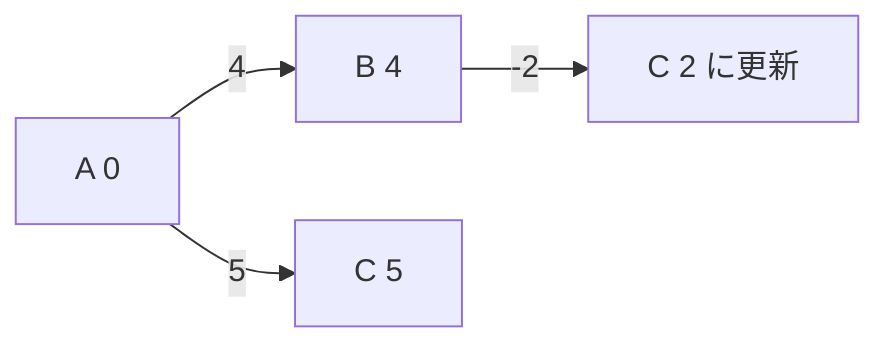

# ベルマンフォード法: マイナスの道も考えて最短距離を探そう

ベルマンフォード法は、すべての辺を何度も確認して最短距離を更新する方法です。マイナスの距離がある場合にも使えます。

ダイクストラ法が「近い場所から確定する」のに対して、ベルマンフォード法は「全ての道を何度も見直す」方法です。

## 使いどころ

- マイナスの辺がある最短経路
- 距離があとから短くなる可能性がある問題
- 負閉路の検出

## 手順

1. スタートの距離を0にする
2. すべての辺を見て、短くできるなら更新する
3. これを `頂点数 - 1` 回くり返す
4. さらに更新できるなら、負閉路がある可能性がある

## 図で見る



## コピペ用コード

```python
def bellman_ford(nodes, edges, start):
    dist = {node: float("inf") for node in nodes}
    dist[start] = 0
    for _ in range(len(nodes) - 1):
        for a, b, cost in edges:
            if dist[a] + cost < dist[b]:
                dist[b] = dist[a] + cost
    return dist

print(bellman_ford(["A", "B", "C"], [("A", "B", 4), ("A", "C", 5), ("B", "C", -2)], "A"))
```

## コードの読み方

- `dist` は、スタートから各地点までの今分かっている最短距離です。
- `for _ in range(len(nodes) - 1)` で、必要な回数だけ全辺を確認します。
- `dist[a] + cost < dist[b]` なら、`b` へのより短い道を見つけたという意味です。

## 計算量

ベルマンフォード法の計算量は **O(VE)**（V: 頂点数、E: 辺の数）です。

| アルゴリズム | 計算量 | 負の辺 |
| :--- | :--- | :--- |
| [ダイクストラ法](/docs/algorithms/dijkstra/) | O((V + E) log V) | 使えない |
| ベルマンフォード法 | O(VE) | 使える |

負の辺がなければダイクストラ法の方が速いので、「負の辺があるときだけベルマンフォード」と使い分けます。

## 別パターン1: 負閉路の検出つき

「V - 1 回の更新で必ず収束する」性質を逆手に取り、V 回目でまだ更新できるなら負閉路がある、と判定します。

```python
def bellman_ford_safe(nodes, edges, start):
    dist = {node: float("inf") for node in nodes}
    dist[start] = 0

    for _ in range(len(nodes) - 1):
        for a, b, cost in edges:
            if dist[a] != float("inf") and dist[a] + cost < dist[b]:
                dist[b] = dist[a] + cost

    # もう1周して、まだ縮むなら負閉路
    for a, b, cost in edges:
        if dist[a] != float("inf") and dist[a] + cost < dist[b]:
            return None  # 負閉路あり

    return dist

nodes = ["A", "B", "C"]
edges = [("A", "B", 4), ("A", "C", 5), ("B", "C", -2)]
print(bellman_ford_safe(nodes, edges, "A"))
# {'A': 0, 'B': 4, 'C': 2}

bad_edges = [("A", "B", 1), ("B", "C", -3), ("C", "A", 1)]
print(bellman_ford_safe(nodes, bad_edges, "A"))
# None (回るたびに -1 される閉路がある)
```

- `dist[a] != float("inf")` の確認を入れると、まだ届いていない頂点からの意味のない更新を防げます。
- 最後のもう1周で更新が起きる＝「何周でも回って距離を減らせる道がある」＝負閉路です。
- 為替の裁定取引（両替をぐるっと回すと増える組み合わせ）の検出にも、この考え方が使われます。

## 別パターン2: 経路も復元する

距離だけでなく「どの道を通ればよいか」も知りたい場合は、更新のたびに「どこから来たか」を記録します。

```python
def bellman_ford_with_path(nodes, edges, start, goal):
    dist = {node: float("inf") for node in nodes}
    prev = {node: None for node in nodes}
    dist[start] = 0

    for _ in range(len(nodes) - 1):
        for a, b, cost in edges:
            if dist[a] != float("inf") and dist[a] + cost < dist[b]:
                dist[b] = dist[a] + cost
                prev[b] = a

    # goal から prev をたどって道を復元
    path = []
    node = goal
    while node is not None:
        path.append(node)
        node = prev[node]
    path.reverse()

    return dist[goal], path

nodes = ["A", "B", "C", "D"]
edges = [("A", "B", 4), ("A", "C", 5), ("B", "C", -2), ("C", "D", 3)]
print(bellman_ford_with_path(nodes, edges, "A", "D"))
# (5, ['A', 'B', 'C', 'D'])
```

- `prev[b] = a` は「b への最短の道は a から来た」というメモです。
- ゴールから `prev` を逆にたどり、最後に反転すると、スタートからの道順になります。
- この復元テクニックは、ダイクストラ法や[幅優先探索](/docs/algorithms/breadth-first-search/)でもまったく同じ形で使えます。

## よくあるミス

| ミス | 何が起きるか | 対処 |
| :--- | :--- | :--- |
| くり返し回数を V 回や適当な回数にする | 収束前に止まる・無駄に回る | 「V - 1 回」を理由ごと覚える（最短路の辺数は最大 V - 1 本） |
| `inf` からの更新を許す | 届いていない頂点経由で誤った距離が入る言語もある | `dist[a] != inf` を確認してから更新する |
| 負閉路があるのに距離を信じる | 実際には無限に小さくできる値を答えにする | もう1周のチェックを入れる |

## 注意点

負の辺は扱えますが、負の閉路があると最短距離が決まりません。閉路を回るたびに距離が小さくなってしまうからです。
