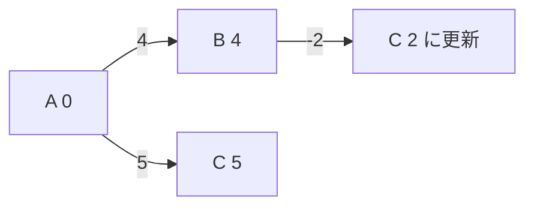

# ベルマンフォード法: マイナスの道も考えて最短距離を探そう

ベルマンフォード法は、すべての辺を何度も確認して最短距離を更新する方法です。マイナスの距離がある場合にも使えます。

ダイクストラ法が「近い場所から確定する」のに対して、ベルマンフォード法は「全ての道を何度も見直す」方法です。

## 使いどころ

- マイナスの辺がある最短経路
- 距離があとから短くなる可能性がある問題
- 負閉路の検出

## 手順

1. スタートの距離を0にする
2. すべての辺を見て、短くできるなら更新する
3. これを `頂点数 - 1` 回くり返す
4. さらに更新できるなら、負閉路がある可能性がある

## 図で見る



## コピペ用コード

```python
def bellman_ford(nodes, edges, start):
    dist = {node: float("inf") for node in nodes}
    dist[start] = 0
    for _ in range(len(nodes) - 1):
        for a, b, cost in edges:
            if dist[a] + cost < dist[b]:
                dist[b] = dist[a] + cost
    return dist

print(bellman_ford(["A", "B", "C"], [("A", "B", 4), ("A", "C", 5), ("B", "C", -2)], "A"))
```

## コードの読み方

- `dist` は、スタートから各地点までの今分かっている最短距離です。
- `for _ in range(len(nodes) - 1)` で、必要な回数だけ全辺を確認します。
- `dist[a] + cost < dist[b]` なら、`b` へのより短い道を見つけたという意味です。

## 注意点

負の辺は扱えますが、負の閉路があると最短距離が決まりません。閉路を回るたびに距離が小さくなってしまうからです。
