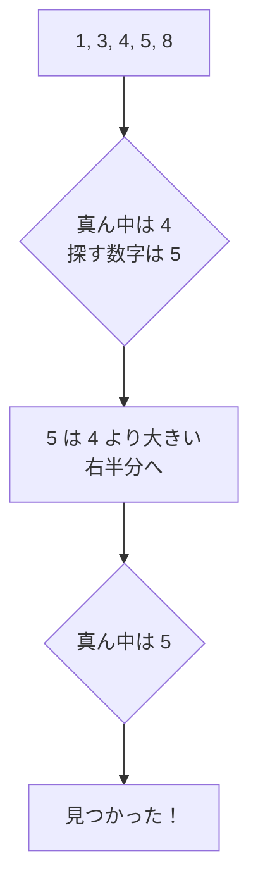

# 二分探索: 半分ずつしぼって探そう

二分探索は、すでに小さい順や大きい順に並んでいるデータから、目的の値を高速に探す方法です。

辞書で単語を探すとき、真ん中あたりを開いて、前半か後半かを判断する動きに似ています。

## ルール

1. 真ん中の数字を見る
2. 探している数字と同じなら終了
3. 探している数字のほうが大きければ右半分を探す
4. 小さければ左半分を探す

## 図で見る



## コピペ用コード

```python
def binary_search(numbers, target):
    left = 0
    right = len(numbers) - 1

    while left <= right:
        middle = (left + right) // 2

        if numbers[middle] == target:
            return middle

        if numbers[middle] < target:
            left = middle + 1
        else:
            right = middle - 1

    return -1

print(binary_search([1, 3, 4, 5, 8], 5))
```

## コードの読み方

- `left` と `right` は「まだ探す範囲」の両端です。
- `middle = (left + right) // 2` で、範囲の真ん中を計算します。`//` は小数を切り捨てる割り算です。
- 真ん中の値が目的より小さければ、答えは右側にしかないので `left = middle + 1` で範囲を右半分にしぼります。
- 逆に大きければ `right = middle - 1` で左半分にしぼります。
- `while left <= right` が成り立たなくなったら、探す範囲がなくなったということなので `-1`（見つからない）を返します。

## 計算量

| 探索方法 | 計算量 | データ10億件のとき |
| :--- | :--- | :--- |
| 線形探索 | O(n) | 最大10億回の比較 |
| 二分探索 | O(log n) | 約30回の比較 |

1回比べるたびに範囲が半分になるので、データが2倍になっても比較回数は1回増えるだけです。この差が、二分探索が「高速」と呼ばれる理由です。

ただし、**データが小さい順（または大きい順）に並んでいることが前提** です。並んでいないデータは、先にソートするか、[線形探索](/docs/algorithms/linear-search/)を使います。

## 別パターン1: 標準ライブラリ bisect を使う

Python には二分探索の標準ライブラリ `bisect` があります。実務や競技プログラミングでは、自分で書くよりこちらが確実です。

```python
import bisect

numbers = [1, 3, 4, 5, 8]
target = 5

index = bisect.bisect_left(numbers, target)

if index < len(numbers) and numbers[index] == target:
    print(f"見つかった: 位置 {index}")
else:
    print("見つからない")
```

- `bisect_left(numbers, target)` は、「`target` を入れるなら、ここ」という位置を返します。
- 返ってきた位置の値が `target` と一致するかを必ず確認します。`bisect_left` 自体は「見つかったかどうか」を教えてくれないためです。

## 別パターン2: 条件を満たす境界を探す

二分探索は「値そのもの」を探すだけでなく、「条件が切り替わる境界」を探すのにも使えます。こちらの形は応用範囲が広く、競技プログラミングで頻出です。

```python
def binary_search_boundary(left, right, is_ok):
    """is_ok(x) が True になる最小の x を探す"""
    while right - left > 1:
        middle = (left + right) // 2
        if is_ok(middle):
            right = middle
        else:
            left = middle
    return right

# 例: 2乗が 50 以上になる最小の整数
answer = binary_search_boundary(0, 100, lambda x: x * x >= 50)
print(answer)  # 8
```

- `left` は「必ず条件を満たさない側」、`right` は「必ず条件を満たす側」に置きます。
- 範囲が隣同士（幅1）になるまで半分にしぼり続けると、`right` が境界になります。

## よくあるミス

| ミス | 何が起きるか | 対処 |
| :--- | :--- | :--- |
| ソートされていないデータに使う | 答えがあるのに見つからない | 先に `sorted()` で並べ替える |
| `left <= right` を `left < right` にする | 最後の1個を調べずに終わる | 探索範囲の条件を確認する |
| `middle + 1` / `middle - 1` を忘れる | 範囲が縮まらず無限ループ | 真ん中を除外して範囲を更新する |
| 見つからない場合の処理を忘れる | `-1` を添字に使ってバグ | 戻り値が `-1` かどうかを確認してから使う |

## AOJで挑戦してみよう！

<div className="aojChallenge">
  <p className="aojChallenge__message">学んだレシピを実際に使って、ジャッジから「Accepted（正解）」を勝ち取ろう！</p>
  <div className="aojChallenge__links">
    <a className="aojChallenge__button" href="https://judge.u-aizu.ac.jp/onlinejudge/description.jsp?id=ALDS1_4_B&lang=ja" target="_blank" rel="noopener noreferrer">
      <span className="aojChallenge__label">ALDS1_4_B: Binary Search</span>
      <span className="aojChallenge__icon" aria-hidden="true">↗</span>
    </a>
  </div>
</div>
