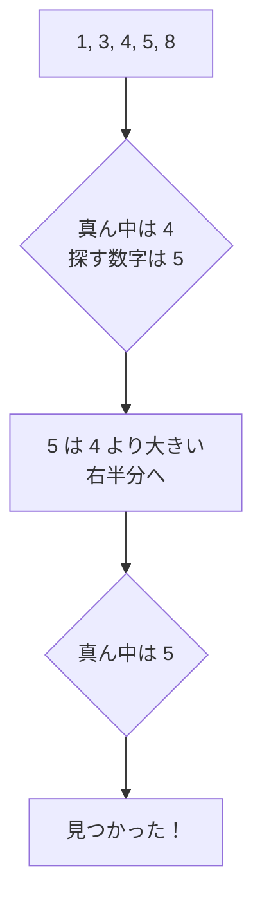

# 二分探索: 半分ずつしぼって探そう

二分探索は、すでに小さい順や大きい順に並んでいるデータから、目的の値を高速に探す方法です。

辞書で単語を探すとき、真ん中あたりを開いて、前半か後半かを判断する動きに似ています。

## ルール

1. 真ん中の数字を見る
2. 探している数字と同じなら終了
3. 探している数字のほうが大きければ右半分を探す
4. 小さければ左半分を探す

## 図で見る



## コピペ用コード

```python
def binary_search(numbers, target):
    left = 0
    right = len(numbers) - 1

    while left <= right:
        middle = (left + right) // 2

        if numbers[middle] == target:
            return middle

        if numbers[middle] < target:
            left = middle + 1
        else:
            right = middle - 1

    return -1

print(binary_search([1, 3, 4, 5, 8], 5))
```

## AOJで挑戦してみよう！

<div className="aojChallenge">
  <p className="aojChallenge__message">学んだレシピを実際に使って、ジャッジから「Accepted（正解）」を勝ち取ろう！</p>
  <div className="aojChallenge__links">
    <a className="aojChallenge__button" href="https://judge.u-aizu.ac.jp/onlinejudge/description.jsp?id=ALDS1_4_B&lang=ja" target="_blank" rel="noopener noreferrer">
      <span className="aojChallenge__label">ALDS1_4_B: Binary Search</span>
      <span className="aojChallenge__icon" aria-hidden="true">↗</span>
    </a>
  </div>
</div>
