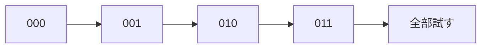

# 全探索: ビットで全パターンを試そう

ビット全探索は、選ぶ・選ばないを0と1で表し、すべての組み合わせを試す方法です。

3個の品物なら、各品物について「選ぶ」「選ばない」の2択があるので、全部で `2 × 2 × 2 = 8` 通りです。

## 使いどころ

- 個数が少ないときの全パターン確認
- 部分集合を作る問題
- ナップサック問題の小さい版

## 手順

1. `0` から `2^n - 1` までの数を使う
2. 各ビットを見る
3. ビットが1ならその要素を選ぶ
4. 作った組み合わせを調べる

## 図で見る



## コピペ用コード

```python
items = [3, 5, 8]

for bit in range(1 << len(items)):
    selected = []
    for i in range(len(items)):
        if bit & (1 << i):
            selected.append(items[i])
    print(selected)
```

## コードの読み方

- `1 << len(items)` は、`2^n` を表します。
- `bit & (1 << i)` で、`i` 番目を選んでいるか判定します。
- `selected` に、そのパターンで選んだ要素を入れています。

## 計算量

ビット全探索の計算量は **O(2^n × n)** です（パターン数 × 各パターンの確認）。

| n | パターン数 | 実行時間の目安 |
| :--- | :--- | :--- |
| 10 | 1,024 | 一瞬 |
| 20 | 約100万 | 1秒前後 |
| 25 | 約3,300万 | 数十秒（きびしい） |
| 40 | 約1兆 | 不可能 → [半分全列挙](/docs/algorithms/meet-in-the-middle/) |

「n が 20 以下なら全部試せる」が目安です。

## 別パターン1: 合計がちょうど target になる選び方を探す

「いくつかの数を選んで合計をぴったり作れるか」という典型問題です。

```python
items = [3, 5, 8, 10]
target = 13

for bit in range(1 << len(items)):
    total = 0
    selected = []
    for i in range(len(items)):
        if bit & (1 << i):
            total += items[i]
            selected.append(items[i])

    if total == target:
        print(f"見つかった: {selected}")  # [5, 8] と [3, 10]
```

- 全パターンを試すので、「見つからない＝存在しない」と断言できるのが全探索の強みです。
- 答えを1つ見つけて終わりたいときは、`print` の後に `break` を入れます。

## 別パターン2: itertools で同じことをする

Python では `itertools.product` や `combinations` でも全パターンを作れます。ビット演算に慣れないうちは、こちらの方が読みやすいかもしれません。

```python
from itertools import product

items = [3, 5, 8, 10]
target = 13

# 各要素について (選ばない, 選ぶ) = (0, 1) の全組み合わせ
for pattern in product([0, 1], repeat=len(items)):
    selected = [item for item, use in zip(items, pattern) if use]
    if sum(selected) == target:
        print(selected)
```

- `product([0, 1], repeat=4)` は `(0,0,0,0)` から `(1,1,1,1)` までの16通りを順に返します。
- `zip(items, pattern)` で「要素」と「選ぶかどうか」をペアにしています。
- 動きはビット全探索と同じです。書き方の好みで選んで構いません。

## ビット演算の早見表

ビット全探索で使う演算をまとめます。

| 書き方 | 意味 | 例 |
| :--- | :--- | :--- |
| `1 << n` | 2^n | `1 << 3` は 8 |
| `bit & (1 << i)` | i 番目のビットが立っているか | 0以外なら立っている |
| `bit \| (1 << i)` | i 番目のビットを立てる | 集合に i を追加 |
| `bin(bit)` | 2進数の文字列で確認 | `bin(5)` は `'0b101'` |
| `bin(bit).count("1")` | 立っているビットの数 | 選んだ個数 |

## よくあるミス

| ミス | 何が起きるか | 対処 |
| :--- | :--- | :--- |
| `range(1 << n)` を `range(2 * n)` と書く | パターンが全然足りない | 2^n は `1 << n` |
| `bit & (1 << i) == 1` と比較する | i > 0 で常に False（結果は 2^i） | `!= 0` 判定か、そのまま if に渡す |
| n が大きいのに使う | 終わらない | n > 20 なら[動的計画法](/docs/algorithms/dynamic-programming/)や半分全列挙を検討 |

## 注意点

要素数が増えるとパターン数が一気に増えます。20個を超えるとかなり重くなることがあります。

## AOJで挑戦してみよう！

<div className="aojChallenge">
  <p className="aojChallenge__message">学んだレシピを実際に使って、ジャッジから「Accepted（正解）」を勝ち取ろう！</p>
  <div className="aojChallenge__links">
    <a className="aojChallenge__button" href="https://judge.u-aizu.ac.jp/onlinejudge/description.jsp?id=ALDS1_5_A&lang=ja" target="_blank" rel="noopener noreferrer">
      <span className="aojChallenge__label">ALDS1_5_A: Exhaustive Search</span>
      <span className="aojChallenge__icon" aria-hidden="true">↗</span>
    </a>
  </div>
</div>
