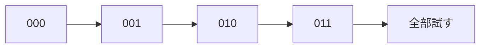

# 全探索: ビットで全パターンを試そう

ビット全探索は、選ぶ・選ばないを0と1で表し、すべての組み合わせを試す方法です。

3個の品物なら、各品物について「選ぶ」「選ばない」の2択があるので、全部で `2 × 2 × 2 = 8` 通りです。

## 使いどころ

- 個数が少ないときの全パターン確認
- 部分集合を作る問題
- ナップサック問題の小さい版

## 手順

1. `0` から `2^n - 1` までの数を使う
2. 各ビットを見る
3. ビットが1ならその要素を選ぶ
4. 作った組み合わせを調べる

## 図で見る



## コピペ用コード

```python
items = [3, 5, 8]

for bit in range(1 << len(items)):
    selected = []
    for i in range(len(items)):
        if bit & (1 << i):
            selected.append(items[i])
    print(selected)
```

## コードの読み方

- `1 << len(items)` は、`2^n` を表します。
- `bit & (1 << i)` で、`i` 番目を選んでいるか判定します。
- `selected` に、そのパターンで選んだ要素を入れています。

## 注意点

要素数が増えるとパターン数が一気に増えます。20個を超えるとかなり重くなることがあります。

## AOJで挑戦してみよう！

<div className="aojChallenge">
  <p className="aojChallenge__message">学んだレシピを実際に使って、ジャッジから「Accepted（正解）」を勝ち取ろう！</p>
  <div className="aojChallenge__links">
    <a className="aojChallenge__button" href="https://judge.u-aizu.ac.jp/onlinejudge/description.jsp?id=ALDS1_5_A&lang=ja" target="_blank" rel="noopener noreferrer">
      <span className="aojChallenge__label">ALDS1_5_A: Exhaustive Search</span>
      <span className="aojChallenge__icon" aria-hidden="true">↗</span>
    </a>
  </div>
</div>
