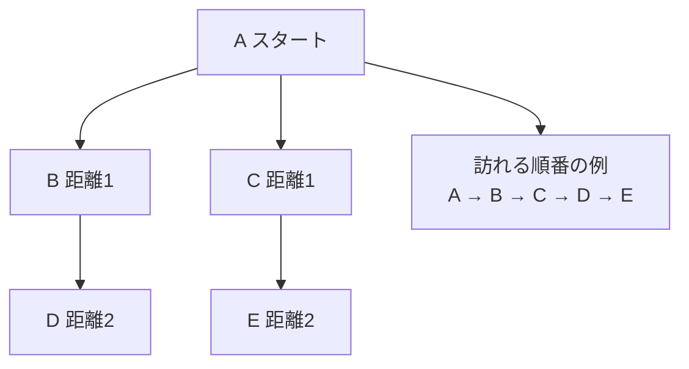

# 幅優先探索法: 近いところから広げよう

幅優先探索法は、スタート地点に近い場所から順番に調べていく方法です。

地図アプリで「今いる場所から一番近い駅、次に近い駅」と広げていくイメージです。

## ルール

1. スタート地点をキューに入れる
2. キューの先頭から1つ取り出して調べる
3. まだ行っていない隣の地点をキューに入れる
4. 近い地点から順番に広がっていく

## 図で見る



## コピペ用コード

```python
from collections import deque

def breadth_first_search(graph, start):
    visited = {start}
    queue = deque([start])
    order = []

    while queue:
        node = queue.popleft()
        order.append(node)

        for next_node in graph[node]:
            if next_node not in visited:
                visited.add(next_node)
                queue.append(next_node)

    return order

graph = {
    "A": ["B", "C"],
    "B": ["D"],
    "C": ["E"],
    "D": [],
    "E": [],
}

print(breadth_first_search(graph, "A"))
```

## コードの読み方

- [キュー](/docs/algorithms/queue/)（`deque`）を使うのが幅優先探索の心臓部です。「先に見つけた場所から先に調べる」ため、近い順に広がります。
- `visited` には **キューに入れた時点** で追加します。取り出すときに追加すると、同じ場所が複数回キューに入ってしまいます。
- `popleft()` で先頭から取り出します。これを `pop()`（末尾）に変えると[深さ優先探索](/docs/algorithms/depth-first-search/)の動きになります。

## 計算量

幅優先探索の計算量は **O(V + E)**（V: 頂点数、E: 辺の数）です。各頂点と各辺を1回ずつしか見ません。

大事な性質として、**辺の重みがすべて同じなら、最初にたどり着いたときの手数が最短距離** です。重みがバラバラの場合は[ダイクストラ法](/docs/algorithms/dijkstra/)を使います。

## 別パターン1: 最短距離を記録する

「何手でたどり着けるか」を記録するバージョンです。幅優先探索の一番よくある使い方です。

```python
from collections import deque

def bfs_distance(graph, start):
    distance = {start: 0}
    queue = deque([start])

    while queue:
        node = queue.popleft()

        for next_node in graph[node]:
            if next_node not in distance:
                distance[next_node] = distance[node] + 1
                queue.append(next_node)

    return distance

graph = {
    "A": ["B", "C"],
    "B": ["A", "D"],
    "C": ["A", "D"],
    "D": ["B", "C", "E"],
    "E": ["D"],
}

print(bfs_distance(graph, "A"))
# {'A': 0, 'B': 1, 'C': 1, 'D': 2, 'E': 3}
```

- `visited` の代わりに `distance` 辞書を使っています。「距離が記録済み＝訪問済み」なので一石二鳥です。
- `distance[next_node] = distance[node] + 1` は「1手先の場所は、今の距離+1」という意味です。

## 別パターン2: 迷路の最短手数を求める

グリッドの迷路で「スタートからゴールまで最短何歩か」を求める、定番の形です。

```python
from collections import deque

maze = [
    "S.#.",
    ".#..",
    "....",
    "#.#G",
]
height, width = len(maze), len(maze[0])

def find(char):
    for r in range(height):
        for c in range(width):
            if maze[r][c] == char:
                return (r, c)

def shortest_steps():
    start, goal = find("S"), find("G")
    distance = {start: 0}
    queue = deque([start])

    while queue:
        r, c = queue.popleft()
        if (r, c) == goal:
            return distance[(r, c)]

        for dr, dc in [(-1, 0), (1, 0), (0, -1), (0, 1)]:
            nr, nc = r + dr, c + dc
            if 0 <= nr < height and 0 <= nc < width:
                if maze[nr][nc] != "#" and (nr, nc) not in distance:
                    distance[(nr, nc)] = distance[(r, c)] + 1
                    queue.append((nr, nc))

    return -1  # たどり着けない

print(shortest_steps())  # 6
```

- 深さ優先探索でも「行けるか」は分かりますが、**最短手数を保証できるのは幅優先探索** です。近い順に調べるので、ゴールに最初に着いた時点の距離が最短です。
- `distance` に入っていないマスだけをキューに入れることで、遠回りの経路で上書きされるのを防いでいます。

## 深さ優先探索との使い分け

| 知りたいこと | 使う探索 |
| :--- | :--- |
| 最短手数・最短距離（重みなし） | 幅優先探索 |
| 行けるかどうか、全パターン列挙 | [深さ優先探索](/docs/algorithms/depth-first-search/) |
| 重みつきの最短距離 | [ダイクストラ法](/docs/algorithms/dijkstra/) |

## よくあるミス

| ミス | 何が起きるか | 対処 |
| :--- | :--- | :--- |
| `visited` への追加を取り出し時にする | 同じ頂点が何度もキューに入り遅くなる | キューに入れる時点で訪問済みにする |
| スタック（`pop()`）を使ってしまう | 深さ優先の順になり最短距離が壊れる | 必ず `popleft()` で先頭から取り出す |
| 重みつきグラフに使う | 手数は最短でも距離は最短でない | ダイクストラ法に切り替える |

## AOJで挑戦してみよう！

<div className="aojChallenge">
  <p className="aojChallenge__message">学んだレシピを実際に使って、ジャッジから「Accepted（正解）」を勝ち取ろう！</p>
  <div className="aojChallenge__links">
    <a className="aojChallenge__button" href="https://judge.u-aizu.ac.jp/onlinejudge/description.jsp?id=ALDS1_11_C&lang=ja" target="_blank" rel="noopener noreferrer">
      <span className="aojChallenge__label">ALDS1_11_C: Breadth First Search</span>
      <span className="aojChallenge__icon" aria-hidden="true">↗</span>
    </a>
  </div>
</div>
