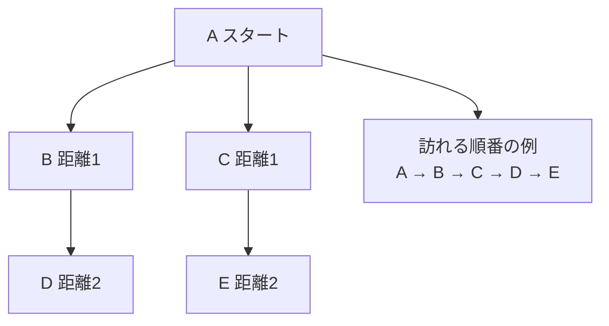

# 幅優先探索法: 近いところから広げよう

幅優先探索法は、スタート地点に近い場所から順番に調べていく方法です。

地図アプリで「今いる場所から一番近い駅、次に近い駅」と広げていくイメージです。

## ルール

1. スタート地点をキューに入れる
2. キューの先頭から1つ取り出して調べる
3. まだ行っていない隣の地点をキューに入れる
4. 近い地点から順番に広がっていく

## 図で見る



## コピペ用コード

```python
from collections import deque

def breadth_first_search(graph, start):
    visited = {start}
    queue = deque([start])
    order = []

    while queue:
        node = queue.popleft()
        order.append(node)

        for next_node in graph[node]:
            if next_node not in visited:
                visited.add(next_node)
                queue.append(next_node)

    return order

graph = {
    "A": ["B", "C"],
    "B": ["D"],
    "C": ["E"],
    "D": [],
    "E": [],
}

print(breadth_first_search(graph, "A"))
```

## AOJで挑戦してみよう！

<div className="aojChallenge">
  <p className="aojChallenge__message">学んだレシピを実際に使って、ジャッジから「Accepted（正解）」を勝ち取ろう！</p>
  <div className="aojChallenge__links">
    <a className="aojChallenge__button" href="https://judge.u-aizu.ac.jp/onlinejudge/description.jsp?id=ALDS1_11_C&lang=ja" target="_blank" rel="noopener noreferrer">
      <span className="aojChallenge__label">ALDS1_11_C: Breadth First Search</span>
      <span className="aojChallenge__icon" aria-hidden="true">↗</span>
    </a>
  </div>
</div>
