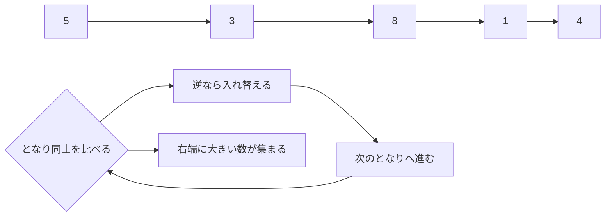

# バブルソート: 背比べで順番をそろえよう

バブルソートは、となり同士をくらべて、順番が逆なら入れ替える並び替えです。

中学生向けに言いかえると、体育の授業で「背の低い順に並んで」と言われたとき、となりの人と何度も背比べしながら、少しずつ正しい順番に近づけるイメージです。

## 背比べのルール

1. 左から順番に、となり同士で背の高さをくらべる
2. 左の人のほうが高ければ、場所を入れ替える
3. 右端まで進むと、いちばん背の高い人が右端にたどり着く
4. これを何回かくり返す

## 図で見る



## コピペ用コード

```python
def bubble_sort(numbers):
    result = numbers[:]

    for end in range(len(result) - 1, 0, -1):
        for i in range(end):
            if result[i] > result[i + 1]:
                result[i], result[i + 1] = result[i + 1], result[i]

    return result

print(bubble_sort([5, 3, 8, 1, 4]))
```

## コードの読み方

- `result = numbers[:]` で元のリストをコピーし、元データを壊さないようにしています。
- 外側の `for end` は「まだ確定していない範囲の右端」です。1周するごとに一番大きい値が右端に確定するので、範囲を1つずつ縮めます。
- `result[i] > result[i + 1]` が「となり同士の背比べ」で、逆なら入れ替えます。

## 計算量

バブルソートの計算量は **O(n²)** です。

| 人数（データ数） | 比較回数の目安 |
| :--- | :--- |
| 10 | 45回 |
| 100 | 約5,000回 |
| 10,000 | 約5,000万回 |

データが10倍になると比較は約100倍になります。学習用には最適ですが、大きなデータには[クイックソート](/docs/algorithms/quick-sort/)や[マージソート](/docs/algorithms/merge-sort/)（O(n log n)）を使います。

## 別パターン1: 途中で終わる改良版

「1周まわって一度も入れ替えがなければ、もう並んでいる」ことを利用した改良です。

```python
def bubble_sort_early_exit(numbers):
    result = numbers[:]

    for end in range(len(result) - 1, 0, -1):
        swapped = False
        for i in range(end):
            if result[i] > result[i + 1]:
                result[i], result[i + 1] = result[i + 1], result[i]
                swapped = True

        if not swapped:
            break  # 入れ替えゼロ = 完成

    return result

print(bubble_sort_early_exit([1, 2, 3, 5, 4]))  # [1, 2, 3, 4, 5]
```

- `swapped` フラグで「この周で入れ替えがあったか」を記録します。
- ほぼ並んでいるデータなら、数周で打ち切れます。最良ケース（すでに並んでいる）は O(n) です。

## 別パターン2: 動きを目で追えるバージョン

1周ごとの状態を表示して、「大きい数が泡のように右へ浮かんでいく」様子を確認できます。

```python
def bubble_sort_verbose(numbers):
    result = numbers[:]

    for round_count, end in enumerate(range(len(result) - 1, 0, -1), 1):
        for i in range(end):
            if result[i] > result[i + 1]:
                result[i], result[i + 1] = result[i + 1], result[i]
        print(f"{round_count}周目: {result} (確定: {result[end:]})")

    return result

bubble_sort_verbose([5, 3, 8, 1, 4])
# 1周目: [3, 5, 1, 4, 8] (確定: [8])
# 2周目: [3, 1, 4, 5, 8] (確定: [5, 8])
# 3周目: [1, 3, 4, 5, 8] (確定: [4, 5, 8])
# 4周目: [1, 3, 4, 5, 8] (確定: [3, 4, 5, 8])
```

- 各周の最後に、右端へ「その周で一番大きかった値」が確定していくのが見えます。
- この「確定した範囲が右から伸びる」という感覚がバブルソートの本質です。

## よくあるミス

| ミス | 何が起きるか | 対処 |
| :--- | :--- | :--- |
| 内側のループを毎回最後まで回す | 動くが無駄な比較が増える | 確定した右端は比べない（`range(end)`） |
| `range(end + 1)` にしてしまう | `result[i + 1]` が範囲外になる | 比較は「i と i+1」なので end の1つ手前まで |
| `>=` で比較する | 動くが同じ値を無駄に入れ替える（安定性も崩れる） | `>` で比較する |

## まとめ

バブルソートは、考え方がわかりやすい並び替えです。一方で、人数や数字が多くなると比べる回数が増えやすいので、大きなデータにはもっと速い方法を使うことがあります。

## AOJで挑戦してみよう！

<div className="aojChallenge">
  <p className="aojChallenge__message">学んだレシピを実際に使って、ジャッジから「Accepted（正解）」を勝ち取ろう！</p>
  <div className="aojChallenge__links">
    <a className="aojChallenge__button" href="https://judge.u-aizu.ac.jp/onlinejudge/description.jsp?id=ALDS1_2_A&lang=ja" target="_blank" rel="noopener noreferrer">
      <span className="aojChallenge__label">ALDS1_2_A: Bubble Sort</span>
      <span className="aojChallenge__icon" aria-hidden="true">↗</span>
    </a>
  </div>
</div>
