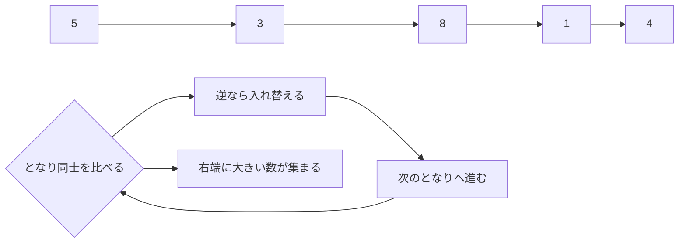

# バブルソート: 背比べで順番をそろえよう

バブルソートは、となり同士をくらべて、順番が逆なら入れ替える並び替えです。

中学生向けに言いかえると、体育の授業で「背の低い順に並んで」と言われたとき、となりの人と何度も背比べしながら、少しずつ正しい順番に近づけるイメージです。

## 背比べのルール

1. 左から順番に、となり同士で背の高さをくらべる
2. 左の人のほうが高ければ、場所を入れ替える
3. 右端まで進むと、いちばん背の高い人が右端にたどり着く
4. これを何回かくり返す

## 図で見る



## コピペ用コード

```python
def bubble_sort(numbers):
    result = numbers[:]

    for end in range(len(result) - 1, 0, -1):
        for i in range(end):
            if result[i] > result[i + 1]:
                result[i], result[i + 1] = result[i + 1], result[i]

    return result

print(bubble_sort([5, 3, 8, 1, 4]))
```

## まとめ

バブルソートは、考え方がわかりやすい並び替えです。一方で、人数や数字が多くなると比べる回数が増えやすいので、大きなデータにはもっと速い方法を使うことがあります。

## AOJで挑戦してみよう！

<div className="aojChallenge">
  <p className="aojChallenge__message">学んだレシピを実際に使って、ジャッジから「Accepted（正解）」を勝ち取ろう！</p>
  <div className="aojChallenge__links">
    <a className="aojChallenge__button" href="https://judge.u-aizu.ac.jp/onlinejudge/description.jsp?id=ALDS1_2_A&lang=ja" target="_blank" rel="noopener noreferrer">
      <span className="aojChallenge__label">ALDS1_2_A: Bubble Sort</span>
      <span className="aojChallenge__icon" aria-hidden="true">↗</span>
    </a>
  </div>
</div>
