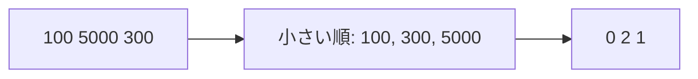

# 座標圧縮: 大きな値を小さな番号に置き換えよう

座標圧縮は、値の大小関係を保ったまま、扱いやすい小さな番号に変える方法です。

`100, 5000, 300` のように値が大きく飛んでいても、順位だけなら `0, 2, 1` のように小さくできます。

## 使いどころ

- 値が大きすぎて配列の添字にできない
- 順位や大小関係だけが必要
- セグメント木やBITと組み合わせる

## 手順

1. 重複を消す
2. 小さい順に並べる
3. それぞれの値に番号をつける
4. 元の値を番号に置き換える

## 図で見る



## コピペ用コード

```python
numbers = [100, 5000, 300]
sorted_unique = sorted(set(numbers))
rank = {value: index for index, value in enumerate(sorted_unique)}

print([rank[number] for number in numbers])
```

## コードの読み方

- `set(numbers)` で重複を消します。
- `sorted()` で小さい順に並べます。
- `rank` は、元の値から圧縮後の番号を引く辞書です。

## 注意点

座標圧縮後の値は元の値そのものではありません。大小関係を保った番号だと考えましょう。
