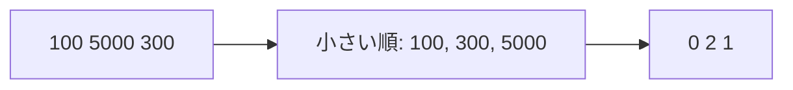

# 座標圧縮: 大きな値を小さな番号に置き換えよう

座標圧縮は、値の大小関係を保ったまま、扱いやすい小さな番号に変える方法です。

`100, 5000, 300` のように値が大きく飛んでいても、順位だけなら `0, 2, 1` のように小さくできます。

## 使いどころ

- 値が大きすぎて配列の添字にできない
- 順位や大小関係だけが必要
- セグメント木やBITと組み合わせる

## 手順

1. 重複を消す
2. 小さい順に並べる
3. それぞれの値に番号をつける
4. 元の値を番号に置き換える

## 図で見る



## コピペ用コード

```python
numbers = [100, 5000, 300]
sorted_unique = sorted(set(numbers))
rank = {value: index for index, value in enumerate(sorted_unique)}

print([rank[number] for number in numbers])
```

## コードの読み方

- `set(numbers)` で重複を消します。
- `sorted()` で小さい順に並べます。
- `rank` は、元の値から圧縮後の番号を引く辞書です。

## 計算量

座標圧縮の計算量は、並べ替えが支配的で **O(n log n)** です。

圧縮する効果は大きく、たとえば値の範囲が 0〜10^9 でも、実際のデータが1万件なら、長さ1万の配列で管理できるようになります。

## 別パターン1: bisect で番号を引く

辞書の代わりに、ソート済みリストから二分探索で番号を求める書き方です。競技プログラミングでよく見る形です。

```python
import bisect

numbers = [100, 5000, 300, 100]
sorted_unique = sorted(set(numbers))

compressed = [bisect.bisect_left(sorted_unique, number) for number in numbers]

print(compressed)  # [0, 2, 1, 0]
```

- `bisect_left(sorted_unique, number)` は、ソート済みリストの中で `number` が入る位置、つまり「自分より小さい値が何種類あるか」を返します。
- 同じ値には同じ番号がつきます（この例では 100 が2回とも 0）。

## 別パターン2: 元の値に戻せるようにする

圧縮した番号で計算したあと、「結果を元の値で表示したい」場面は多いです。復元用のリストを持っておきます。

```python
scores = [98000, 1200, 45000, 1200, 98000]
sorted_unique = sorted(set(scores))          # 番号 → 元の値
rank = {value: index for index, value in enumerate(sorted_unique)}  # 元の値 → 番号

compressed = [rank[score] for score in scores]
print(compressed)               # [2, 0, 1, 0, 2]

# 番号から元の値に戻す
print(sorted_unique[2])         # 98000
print([sorted_unique[c] for c in compressed])  # 元のリストに戻る
```

- `rank`（値→番号）と `sorted_unique`（番号→値）の2つで、両方向の変換ができます。
- 「圧縮 → 計算 → 復元」の3ステップで考えると整理しやすいです。

## 使いどころの具体例

たとえば「イベントの開始・終了時刻が 0〜10^9 の範囲で与えられ、重なりを調べたい」とき、時刻をそのまま配列の添字にはできません。座標圧縮で「登場する時刻だけ」に番号をつければ、[いもす法](/docs/algorithms/imos/)や[セグメント木](/docs/algorithms/segment-tree/)と組み合わせて処理できます。

## よくあるミス

| ミス | 何が起きるか | 対処 |
| :--- | :--- | :--- |
| 重複を消し忘れる（`set` を通さない） | 同じ値に別の番号がつく | `sorted(set(...))` の形を守る |
| 圧縮後の番号で大小以外の計算をする | 「差」や「合計」が意味を失う | 差や合計が必要なら元の値を使う |
| 復元用のリストを持たない | 結果を元の値で出せない | `sorted_unique` を残しておく |

## 注意点

座標圧縮後の値は元の値そのものではありません。大小関係を保った番号だと考えましょう。
