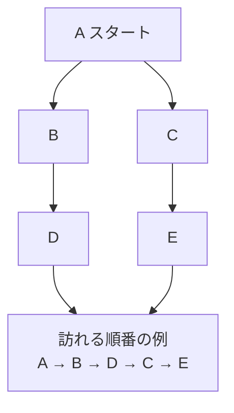

# 深さ優先探索法: 行けるところまで進もう

深さ優先探索法は、分かれ道があるときに、まず1つの道を行けるところまで進み、行き止まりになったら戻る方法です。

迷路で「まず右の道を最後まで進んで、だめなら戻る」と決めるイメージです。

## ルール

1. スタート地点を訪れる
2. まだ行っていない隣の地点へ進む
3. 行けるところまで進む
4. 行き止まりになったら、1つ前に戻る

## 図で見る



## コピペ用コード

```python
def depth_first_search(graph, start):
    visited = set()
    order = []

    def visit(node):
        visited.add(node)
        order.append(node)

        for next_node in graph[node]:
            if next_node not in visited:
                visit(next_node)

    visit(start)
    return order

graph = {
    "A": ["B", "C"],
    "B": ["D"],
    "C": ["E"],
    "D": [],
    "E": [],
}

print(depth_first_search(graph, "A"))
```

## AOJで挑戦してみよう！

<div className="aojChallenge">
  <p className="aojChallenge__message">学んだレシピを実際に使って、ジャッジから「Accepted（正解）」を勝ち取ろう！</p>
  <div className="aojChallenge__links">
    <a className="aojChallenge__button" href="https://judge.u-aizu.ac.jp/onlinejudge/description.jsp?id=ALDS1_11_B&lang=ja" target="_blank" rel="noopener noreferrer">
      <span className="aojChallenge__label">ALDS1_11_B: Depth First Search</span>
      <span className="aojChallenge__icon" aria-hidden="true">↗</span>
    </a>
  </div>
</div>
