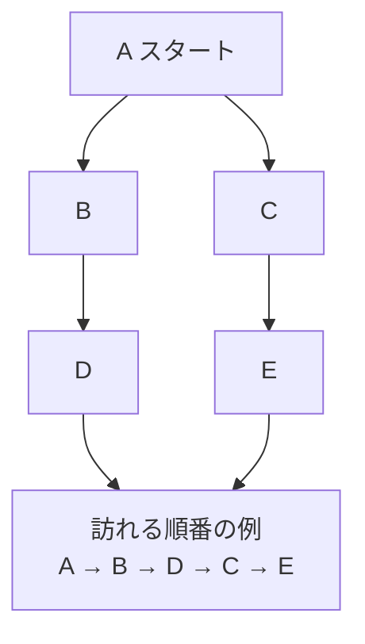

# 深さ優先探索法: 行けるところまで進もう

深さ優先探索法は、分かれ道があるときに、まず1つの道を行けるところまで進み、行き止まりになったら戻る方法です。

迷路で「まず右の道を最後まで進んで、だめなら戻る」と決めるイメージです。

## ルール

1. スタート地点を訪れる
2. まだ行っていない隣の地点へ進む
3. 行けるところまで進む
4. 行き止まりになったら、1つ前に戻る

## 図で見る



## コピペ用コード

```python
def depth_first_search(graph, start):
    visited = set()
    order = []

    def visit(node):
        visited.add(node)
        order.append(node)

        for next_node in graph[node]:
            if next_node not in visited:
                visit(next_node)

    visit(start)
    return order

graph = {
    "A": ["B", "C"],
    "B": ["D"],
    "C": ["E"],
    "D": [],
    "E": [],
}

print(depth_first_search(graph, "A"))
```

## コードの読み方

- `visited` は「一度行った場所」の集合です。これがないと、道がループしているグラフで同じ場所を無限に回り続けます。
- `visit()` は自分自身を呼ぶ[再帰関数](/docs/algorithms/recursion/)です。「進めるだけ進む」動きは、再帰の呼び出しがそのまま表現してくれます。
- 行き止まり（未訪問の隣がない）に着くと関数が終わり、自動的に1つ前へ「戻る」動きになります。

## 計算量

深さ優先探索の計算量は **O(V + E)**（V: 頂点数、E: 辺の数）です。各頂点と各辺を1回ずつしか見ないためです。[幅優先探索](/docs/algorithms/breadth-first-search/)も同じ計算量で、違いは「調べる順番」だけです。

| 探索 | 調べる順番 | 得意なこと |
| :--- | :--- | :--- |
| 深さ優先探索 | 1本の道を最後まで | 全パターン列挙、連結判定、迷路の解の存在確認 |
| 幅優先探索 | 近い場所から順に | 最短距離（辺の重みがすべて同じとき） |

## 別パターン1: スタックで書く（再帰なし）

再帰の深さ制限が心配な大きなグラフでは、[スタック](/docs/algorithms/stack/)を自分で管理する書き方が安全です。

```python
def dfs_with_stack(graph, start):
    visited = set()
    order = []
    stack = [start]

    while stack:
        node = stack.pop()
        if node in visited:
            continue
        visited.add(node)
        order.append(node)

        # 逆順に積むと、再帰版と同じ順番で訪問できる
        for next_node in reversed(graph[node]):
            if next_node not in visited:
                stack.append(next_node)

    return order

graph = {
    "A": ["B", "C"],
    "B": ["D"],
    "C": ["E"],
    "D": [],
    "E": [],
}

print(dfs_with_stack(graph, "A"))  # ['A', 'B', 'D', 'C', 'E']
```

- 再帰の代わりに、`stack` に「これから行く場所」を積みます。
- `stack.pop()` は最後に積んだものから取り出すので、「進めるだけ進む」順番になります。
- 取り出したときに訪問済みかを確認することで、同じ場所の二重処理を防いでいます。

## 別パターン2: 2次元の迷路を探索する

グリッド（マス目）も、上下左右をつながりとみなせばグラフです。「スタートからゴールへ行けるか」を判定します。

```python
maze = [
    "S.#.",
    ".#..",
    "....",
    "#.#G",
]

height = len(maze)
width = len(maze[0])

def find(char):
    for r in range(height):
        for c in range(width):
            if maze[r][c] == char:
                return (r, c)

def can_reach_goal():
    start = find("S")
    goal = find("G")
    visited = set()
    stack = [start]

    while stack:
        r, c = stack.pop()
        if (r, c) == goal:
            return True
        if (r, c) in visited:
            continue
        visited.add((r, c))

        for dr, dc in [(-1, 0), (1, 0), (0, -1), (0, 1)]:
            nr, nc = r + dr, c + dc
            if 0 <= nr < height and 0 <= nc < width:
                if maze[nr][nc] != "#" and (nr, nc) not in visited:
                    stack.append((nr, nc))

    return False

print(can_reach_goal())  # True
```

- `#` が壁、`.` が道です。マスの座標 `(r, c)` を頂点として扱います。
- `[(-1, 0), (1, 0), (0, -1), (0, 1)]` は上下左右への移動です。この4方向リストはグリッド探索の定番の書き方です。
- `0 <= nr < height` の範囲チェックで、迷路の外に出ないようにしています。

## よくあるミス

| ミス | 何が起きるか | 対処 |
| :--- | :--- | :--- |
| `visited` を使わない | ループのあるグラフで無限再帰 | 訪問済み集合を必ず持つ |
| 深いグラフで再帰版を使う | `RecursionError` | `sys.setrecursionlimit` を上げるか、スタック版にする |
| グリッドで範囲チェックを忘れる | `IndexError` や逆側へワープ | 移動後の座標が盤面内か先に確認する |

## AOJで挑戦してみよう！

<div className="aojChallenge">
  <p className="aojChallenge__message">学んだレシピを実際に使って、ジャッジから「Accepted（正解）」を勝ち取ろう！</p>
  <div className="aojChallenge__links">
    <a className="aojChallenge__button" href="https://judge.u-aizu.ac.jp/onlinejudge/description.jsp?id=ALDS1_11_B&lang=ja" target="_blank" rel="noopener noreferrer">
      <span className="aojChallenge__label">ALDS1_11_B: Depth First Search</span>
      <span className="aojChallenge__icon" aria-hidden="true">↗</span>
    </a>
  </div>
</div>
