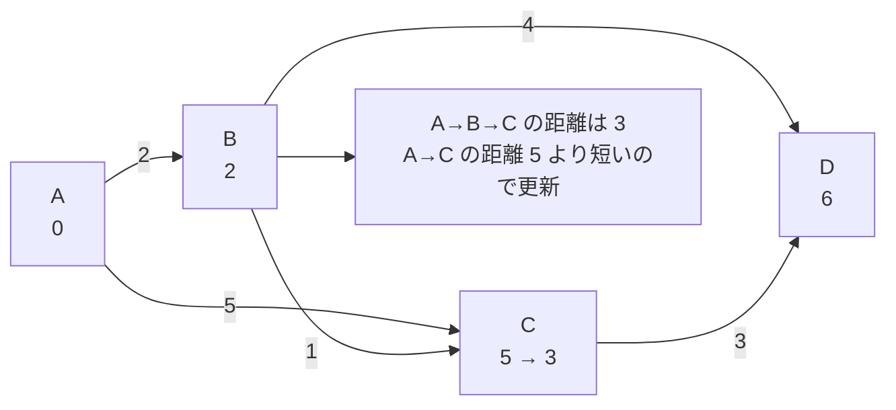

# ダイクストラ法: 目的地への最速ルートを探そう

ダイクストラ法は、道ごとに距離や時間が決まっている地図から、スタート地点から各地点までの最短距離を求める方法です。

地図アプリが「遠回りに見えても、こっちの道のほうが早い」と判断するイメージです。

## ルール

1. スタート地点の距離を0にする
2. まだ確定していない地点の中で、一番近い地点を選ぶ
3. その地点から行ける道を調べて、より短い距離なら更新する
4. すべての地点が確定するまでくり返す

## 図で見る



## コピペ用コード

```python
import heapq

def dijkstra(graph, start):
    distances = {node: float("inf") for node in graph}
    distances[start] = 0
    queue = [(0, start)]

    while queue:
        current_distance, current_node = heapq.heappop(queue)

        if current_distance > distances[current_node]:
            continue

        for next_node, cost in graph[current_node]:
            new_distance = current_distance + cost

            if new_distance < distances[next_node]:
                distances[next_node] = new_distance
                heapq.heappush(queue, (new_distance, next_node))

    return distances

graph = {
    "A": [("B", 2), ("C", 5)],
    "B": [("C", 1), ("D", 4)],
    "C": [("D", 3)],
    "D": [],
}

print(dijkstra(graph, "A"))
```

## AOJで挑戦してみよう！

<div className="aojChallenge">
  <p className="aojChallenge__message">学んだレシピを実際に使って、ジャッジから「Accepted（正解）」を勝ち取ろう！</p>
  <div className="aojChallenge__links">
    <a className="aojChallenge__button" href="https://judge.u-aizu.ac.jp/onlinejudge/description.jsp?id=ALDS1_12_B&lang=ja" target="_blank" rel="noopener noreferrer">
      <span className="aojChallenge__label">ALDS1_12_B: Single Source Shortest Path</span>
      <span className="aojChallenge__icon" aria-hidden="true">↗</span>
    </a>
  </div>
</div>
