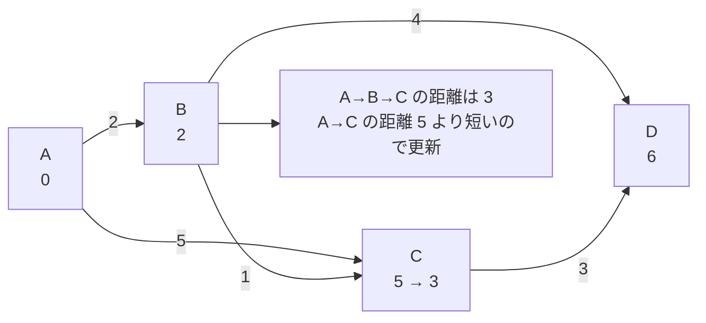

# ダイクストラ法: 目的地への最速ルートを探そう

ダイクストラ法は、道ごとに距離や時間が決まっている地図から、スタート地点から各地点までの最短距離を求める方法です。

地図アプリが「遠回りに見えても、こっちの道のほうが早い」と判断するイメージです。

## ルール

1. スタート地点の距離を0にする
2. まだ確定していない地点の中で、一番近い地点を選ぶ
3. その地点から行ける道を調べて、より短い距離なら更新する
4. すべての地点が確定するまでくり返す

## 図で見る



## コピペ用コード

```python
import heapq

def dijkstra(graph, start):
    distances = {node: float("inf") for node in graph}
    distances[start] = 0
    queue = [(0, start)]

    while queue:
        current_distance, current_node = heapq.heappop(queue)

        if current_distance > distances[current_node]:
            continue

        for next_node, cost in graph[current_node]:
            new_distance = current_distance + cost

            if new_distance < distances[next_node]:
                distances[next_node] = new_distance
                heapq.heappush(queue, (new_distance, next_node))

    return distances

graph = {
    "A": [("B", 2), ("C", 5)],
    "B": [("C", 1), ("D", 4)],
    "C": [("D", 3)],
    "D": [],
}

print(dijkstra(graph, "A"))
```

## コードの読み方

- `distances` は「今わかっている最短距離」の表です。最初はスタート以外すべて無限大にします。
- [優先度付きキュー](/docs/algorithms/priority-queue/)（`heapq`）から、常に「一番近い未確定の地点」を取り出します。ここがダイクストラ法の心臓部です。
- `current_distance > distances[current_node]` は、古い情報（すでにもっと短い道が見つかっている地点）を読み飛ばす処理です。
- 取り出した地点から行ける先を調べ、より短くなるなら表を更新してキューに入れます。

## 計算量

優先度付きキューを使ったダイクストラ法は **O(E log V)**（V: 頂点数、E: 辺の数）です。頂点・辺が10万以上ある問題でも現実的に動きます。

| 方法 | 計算量 | 使える条件 |
| :--- | :--- | :--- |
| [幅優先探索](/docs/algorithms/breadth-first-search/) | O(V + E) | 全部の道の長さが同じ |
| ダイクストラ法 | O(E log V) | 道の長さが0以上 |
| [ベルマン・フォード法](/docs/algorithms/bellman-ford/) | O(V × E) | 負の長さの道があってもよい |

**負のコストの辺があるとダイクストラ法は正しく動きません。** その場合はベルマン・フォード法を使います。

## 別パターン1: 経路の復元（どの道を通るか）

距離だけでなく「実際のルート」も知りたい場合は、「どこから来たか」を記録します。

```python
import heapq

def dijkstra_with_path(graph, start, goal):
    distances = {node: float("inf") for node in graph}
    distances[start] = 0
    previous = {node: None for node in graph}
    queue = [(0, start)]

    while queue:
        current_distance, current_node = heapq.heappop(queue)
        if current_distance > distances[current_node]:
            continue

        for next_node, cost in graph[current_node]:
            new_distance = current_distance + cost
            if new_distance < distances[next_node]:
                distances[next_node] = new_distance
                previous[next_node] = current_node  # どこから来たか
                heapq.heappush(queue, (new_distance, next_node))

    # ゴールから previous を逆にたどる
    path = []
    node = goal
    while node is not None:
        path.append(node)
        node = previous[node]
    path.reverse()

    return distances[goal], path

graph = {
    "A": [("B", 2), ("C", 5)],
    "B": [("C", 1), ("D", 4)],
    "C": [("D", 3)],
    "D": [],
}

distance, path = dijkstra_with_path(graph, "A", "D")
print(distance)  # 6
print(path)      # ['A', 'B', 'D'] (A→B→C→D も距離6で、先に見つかった方が残る)
```

- 距離を更新するたびに `previous[next_node]` に「1つ手前の地点」を残します。
- ゴールから `previous` を逆にたどって反転すれば、ルートが手に入ります。地図アプリの「経路表示」と同じ仕組みです。

## 別パターン2: 頂点が番号のとき（競プロの入力形式）

競技プログラミングでは頂点が 0〜n-1 の番号で与えられることが多いので、辞書ではなくリストで書く形も覚えておくと便利です。

```python
import heapq

def dijkstra_list(n, edges, start):
    graph = [[] for _ in range(n)]
    for a, b, cost in edges:
        graph[a].append((b, cost))

    INF = float("inf")
    distances = [INF] * n
    distances[start] = 0
    queue = [(0, start)]

    while queue:
        d, node = heapq.heappop(queue)
        if d > distances[node]:
            continue
        for next_node, cost in graph[node]:
            if d + cost < distances[next_node]:
                distances[next_node] = d + cost
                heapq.heappush(queue, (d + cost, next_node))

    return distances

# (出発, 到着, コスト) の一方通行の道
edges = [(0, 1, 2), (0, 2, 5), (1, 2, 1), (1, 3, 4), (2, 3, 3)]
print(dijkstra_list(4, edges, 0))  # [0, 2, 3, 6]
```

- 辞書よりリストのほうが速く、AOJやAtCoderの入力形式にそのまま合わせられます。
- 双方向の道なら `graph[b].append((a, cost))` も追加します。

## よくあるミス

| ミス | 何が起きるか | 対処 |
| :--- | :--- | :--- |
| 負のコストの辺に使う | 答えが間違う（エラーは出ない） | ベルマン・フォード法に切り替える |
| 古い情報の読み飛ばしを忘れる | 動くが同じ頂点を何度も処理して遅い | `current_distance > distances[...]: continue` を入れる |
| キューに `(頂点, 距離)` の順で入れる | 距離順に取り出されなくなる | タプルは `(距離, 頂点)` の順にする |

## AOJで挑戦してみよう！

<div className="aojChallenge">
  <p className="aojChallenge__message">学んだレシピを実際に使って、ジャッジから「Accepted（正解）」を勝ち取ろう！</p>
  <div className="aojChallenge__links">
    <a className="aojChallenge__button" href="https://judge.u-aizu.ac.jp/onlinejudge/description.jsp?id=ALDS1_12_B&lang=ja" target="_blank" rel="noopener noreferrer">
      <span className="aojChallenge__label">ALDS1_12_B: Single Source Shortest Path</span>
      <span className="aojChallenge__icon" aria-hidden="true">↗</span>
    </a>
  </div>
</div>
