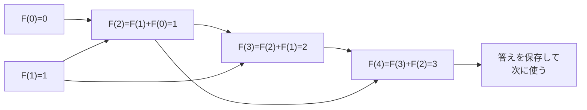

# 動的計画法: 小さな答えを再利用しよう

動的計画法は、同じ計算を何度もやらないように、小さな問題の答えを保存して使い回す考え方です。

一度解いた宿題の途中式をノートに残して、次の問題で再利用するイメージです。

## フィボナッチ数で見る

フィボナッチ数は、前の2つの数を足して次の数を作ります。

```text
0, 1, 1, 2, 3, 5, 8, 13 ...
```

## ルール

1. 小さな答えを先に用意する
2. その答えを使って、次の答えを作る
3. 作った答えを保存する
4. 保存した答えを再利用して、大きな答えへ進む

## 図で見る



## コピペ用コード

```python
def fibonacci(n):
    if n <= 1:
        return n

    answers = [0] * (n + 1)
    answers[0] = 0
    answers[1] = 1

    for i in range(2, n + 1):
        answers[i] = answers[i - 1] + answers[i - 2]

    return answers[n]


print(fibonacci(10))
```

## 問いかけ

同じ計算を何度もくり返すプログラムは、どんな工夫をすると速くできそうですか？
