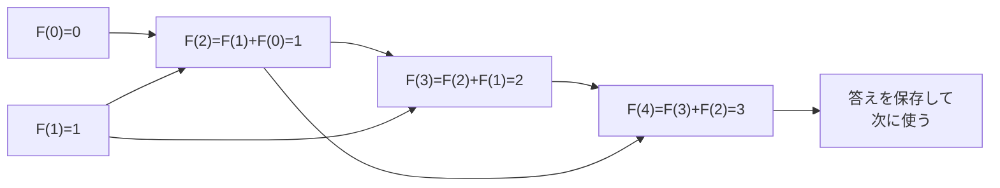

# 動的計画法: 小さな答えを再利用しよう

動的計画法は、同じ計算を何度もやらないように、小さな問題の答えを保存して使い回す考え方です。

一度解いた宿題の途中式をノートに残して、次の問題で再利用するイメージです。

## フィボナッチ数で見る

フィボナッチ数は、前の2つの数を足して次の数を作ります。

```text
0, 1, 1, 2, 3, 5, 8, 13 ...
```

## ルール

1. 小さな答えを先に用意する
2. その答えを使って、次の答えを作る
3. 作った答えを保存する
4. 保存した答えを再利用して、大きな答えへ進む

## 図で見る



## コピペ用コード

```python
def fibonacci(n):
    if n <= 1:
        return n

    answers = [0] * (n + 1)
    answers[0] = 0
    answers[1] = 1

    for i in range(2, n + 1):
        answers[i] = answers[i - 1] + answers[i - 2]

    return answers[n]

print(fibonacci(10))
```

## コードの読み方

- `answers` が「途中式を残すノート」です。`answers[i]` に「i 番目のフィボナッチ数」を保存します。
- 小さい方（`answers[0]`, `answers[1]`）から順に埋めていくので、`answers[i - 1]` と `answers[i - 2]` は必ず計算済みです。
- 同じ計算を二度としないため、O(n) で終わります。素朴な再帰だと O(2^n) かかるのと対照的です。

## メモ化再帰との関係

動的計画法には2つの書き方があります。答えは同じです。

| 書き方 | 進む向き | 特徴 |
| :--- | :--- | :--- |
| ボトムアップ（上のコード） | 小さい方から表を埋める | ループで書ける。速い |
| メモ化再帰 | 大きい方から必要な分だけ | [再帰](/docs/algorithms/recursion/)＋`lru_cache` で書きやすい |

```python
from functools import lru_cache

@lru_cache(maxsize=None)
def fib(n):
    if n <= 1:
        return n
    return fib(n - 1) + fib(n - 2)

print(fib(10))  # 55
```

## 別パターン1: 階段の上り方問題

「1段か2段ずつ上れる階段を、n 段上る方法は何通りか」という定番問題です。実はフィボナッチと同じ形をしています。

```python
def count_stairs(n):
    ways = [0] * (n + 1)
    ways[0] = 1  # 「上らない」の1通り
    if n >= 1:
        ways[1] = 1

    for i in range(2, n + 1):
        ways[i] = ways[i - 1] + ways[i - 2]

    return ways[n]

print(count_stairs(4))   # 5
print(count_stairs(10))  # 89
```

- 「i 段目に来る直前は、i-1 段目（1歩）か i-2 段目（2歩）のどちらか」なので、`ways[i] = ways[i - 1] + ways[i - 2]` です。
- **「最後の一手で場合分けして、小さい問題の答えを足す」** —— これがDPの式（漸化式）を立てる基本パターンです。

## 別パターン2: 最小コストで階段を上る

「各段にコストがあり、合計コストを最小にしたい」という、最小値を求めるDPです。

```python
def min_cost_stairs(costs):
    n = len(costs)
    dp = [float("inf")] * n
    dp[0] = costs[0]
    if n >= 2:
        dp[1] = costs[1]

    for i in range(2, n):
        dp[i] = costs[i] + min(dp[i - 1], dp[i - 2])

    return dp[n - 1]

# 各段を踏むコスト
print(min_cost_stairs([1, 100, 1, 1, 100, 1]))  # 4 (0→2→3→5)
```

- 「数える」DPは足し算、「最小・最大」を求めるDPは `min`/`max` を使います。式の形はほぼ同じです。
- `dp[i]` の意味（「i 段目まで来る最小コスト」）を最初に日本語で決めるのが、DPを書くときの一番のコツです。

## DPの問題を解く手順

1. **`dp[i]` の意味を日本語で決める**（例:「i 段目までの上り方の数」）
2. **一番小さいケースを埋める**（例: `dp[0] = 1`）
3. **漸化式を立てる**（例: 最後の一手で場合分けして足す）
4. **埋める順番を決める**（小さい方から）

この型は、[0-1ナップサック問題](/docs/algorithms/zero-one-knapsack/)や[最長増加部分列](/docs/algorithms/longest-increasing-subsequence/)でも同じです。

## よくあるミス

| ミス | 何が起きるか | 対処 |
| :--- | :--- | :--- |
| `dp` 配列のサイズを `n` にする | `dp[n]` で範囲外エラー | 「n 番目まで」なら `n + 1` で確保 |
| 初期値（ベースケース）を間違える | 全体の答えが一律にずれる | 一番小さいケースを手計算で確認する |
| `dp[i]` の意味が途中でぶれる | 漸化式が破綻する | 意味をコメントで書いてから式を立てる |

## AOJで挑戦してみよう！

<div className="aojChallenge">
  <p className="aojChallenge__message">学んだレシピを実際に使って、ジャッジから「Accepted（正解）」を勝ち取ろう！</p>
  <div className="aojChallenge__links">
    <a className="aojChallenge__button" href="https://judge.u-aizu.ac.jp/onlinejudge/description.jsp?id=ALDS1_10_A&lang=ja" target="_blank" rel="noopener noreferrer">
      <span className="aojChallenge__label">ALDS1_10_A: Fibonacci Number</span>
      <span className="aojChallenge__icon" aria-hidden="true">↗</span>
    </a>
    <a className="aojChallenge__button" href="https://judge.u-aizu.ac.jp/onlinejudge/description.jsp?id=ALDS1_10_C&lang=ja" target="_blank" rel="noopener noreferrer">
      <span className="aojChallenge__label">ALDS1_10_C: Longest Common Subsequence</span>
      <span className="aojChallenge__icon" aria-hidden="true">↗</span>
    </a>
  </div>
</div>
