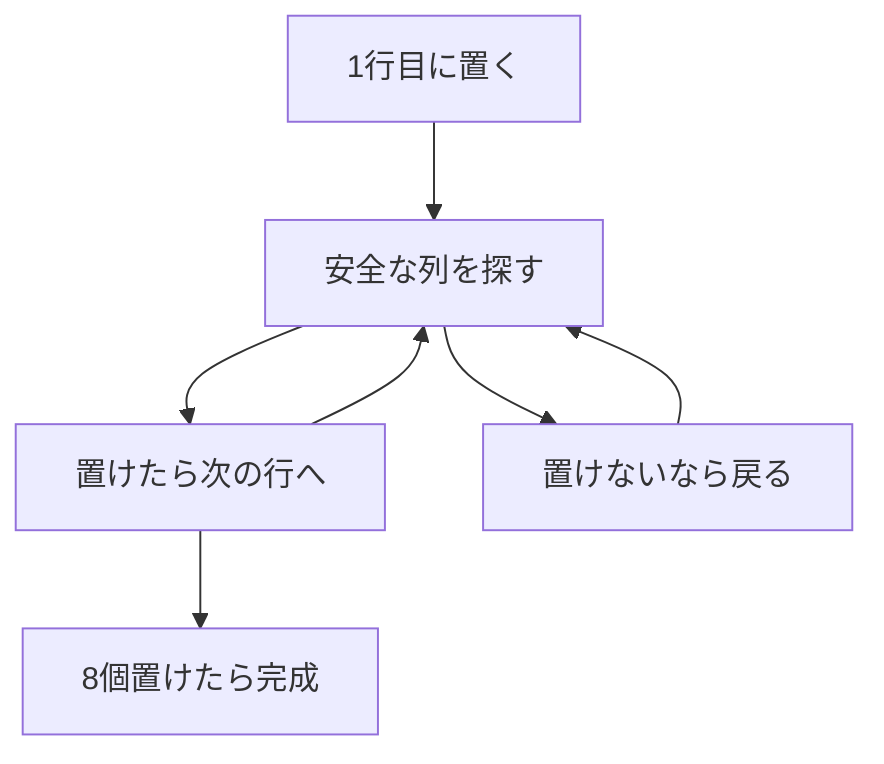

# 8クイーン問題: 置ける場所を試して戻ろう

8クイーン問題は、8×8のチェス盤に8個のクイーンを置き、どのクイーンも互いに取られないようにするパズルです。

クイーンは縦、横、斜めに動けます。つまり、同じ列や斜めに別のクイーンがある場所には置けません。

## 使いどころ

- 条件を満たす配置を探す問題
- 再帰関数の練習
- ダメなら一つ前に戻る「バックトラッキング」の理解

## 手順

1. 上の行から順番にクイーンを置く
2. その列と斜めが安全か調べる
3. 置けるなら次の行へ進む
4. 進めなくなったら、前の行へ戻って別の列を試す

## 図で見る



## コピペ用コード

```python
N = 8
board = [-1] * N


def is_safe(row, col):
    for r in range(row):
        c = board[r]
        if c == col:
            return False
        if abs(row - r) == abs(col - c):
            return False
    return True


def solve(row=0):
    if row == N:
        return True

    for col in range(N):
        if is_safe(row, col):
            board[row] = col
            if solve(row + 1):
                return True
            board[row] = -1

    return False


solve()
print(board)
```

## コードの読み方

- `board[row] = col` は、その行のどの列にクイーンを置いたかを表します。
- `is_safe()` で、同じ列と斜めにクイーンがいないか確認します。
- `solve(row + 1)` が失敗したら、`board[row] = -1` で置く前の状態に戻します。
- 斜めの判定 `abs(row - r) == abs(col - c)` は、「行の差と列の差が同じなら斜め45度の線上にある」という性質を使っています。

## 計算量

行ごとに1個ずつ置くので「同じ行」の衝突は最初から起きません。単純に8個のマスを全部試すと \(64^8\)（約2.8京）通りですが、バックトラッキングでダメな枝を早めに切ることで、実際に調べる配置は数千通りまで減ります。

- 8クイーンの解は **92通り**（回転・鏡映を同じとみなすと12通り）あります。

## 別パターン1: 盤面を絵で表示する

答えの `[0, 4, 7, 5, 2, 6, 1, 3]` だけでは分かりにくいので、盤面として描いてみましょう。

```python
def print_board(board):
    n = len(board)
    for row in range(n):
        line = ""
        for col in range(n):
            line += "Q " if board[row] == col else ". "
        print(line)

print_board([0, 4, 7, 5, 2, 6, 1, 3])
# Q . . . . . . .
# . . . . Q . . .
# . . . . . . . Q
# . . . . . Q . .
# . . Q . . . . .
# . . . . . . Q .
# . Q . . . . . .
# . . . Q . . . .
```

- どの行・列・斜めにも2個以上のQがないことが目で確認できます。

## 別パターン2: 解の総数を数える（集合で高速判定）

`is_safe` のループをやめて、「使用済みの列・斜め」を集合で持つと、判定が O(1) になります。全解を数える定番の書き方です。

```python
def count_queens(n):
    count = 0
    cols = set()        # 使用済みの列
    diag1 = set()       # 右下がりの斜め (row - col が同じ)
    diag2 = set()       # 右上がりの斜め (row + col が同じ)

    def solve(row):
        nonlocal count
        if row == n:
            count += 1
            return
        for col in range(n):
            if col in cols or (row - col) in diag1 or (row + col) in diag2:
                continue
            cols.add(col)
            diag1.add(row - col)
            diag2.add(row + col)
            solve(row + 1)
            cols.remove(col)       # 戻すのを忘れない
            diag1.remove(row - col)
            diag2.remove(row + col)

    solve(0)
    return count

print(count_queens(4))  # 2
print(count_queens(8))  # 92
```

- 同じ右下がりの斜めにあるマスは `row - col` が等しく、右上がりは `row + col` が等しい——この性質で斜めを1つの数字で表せます。
- 「置く（add）→ 進む（solve）→ 戻す（remove）」の3点セットがバックトラッキングの型です。

## バックトラッキングの考え方

8クイーンで学ぶ「ダメなら戻る」は、いろいろな探索問題に応用できます。

1. **選ぶ**: 候補を1つ選んで状態を進める
2. **試す**: 再帰で次の段階へ進む
3. **戻す**: 失敗したら選ぶ前の状態に戻して、別の候補を試す

数独ソルバー、迷路の全経路列挙、[ビット全探索](/docs/algorithms/bit-bruteforce/)では間に合わない大きな組み合わせの枝刈り探索など、多くの場面でこの型が登場します。

## よくあるミス

| ミス | 何が起きるか | 対処 |
| :--- | :--- | :--- |
| 失敗時に状態を戻し忘れる | 置けるはずの場所が「使用済み」のままになり解が見つからない | add と remove を必ず対で書く |
| 斜めの判定を1方向しかしない | 斜め衝突を見逃した「解」が出る | 右下がり（row-col）と右上がり（row+col）の両方を見る |
| 最初の解で `return True` し忘れる | 全部探索して遅くなる（1つだけ欲しい場合） | 見つかったら即座に True を伝播させる |

## AOJで挑戦してみよう！

<div className="aojChallenge">
  <p className="aojChallenge__message">学んだレシピを実際に使って、ジャッジから「Accepted（正解）」を勝ち取ろう！</p>
  <div className="aojChallenge__links">
    <a className="aojChallenge__button" href="https://judge.u-aizu.ac.jp/onlinejudge/description.jsp?id=ALDS1_13_A&lang=ja" target="_blank" rel="noopener noreferrer">
      <span className="aojChallenge__label">ALDS1_13_A: 8-Queens Problem</span>
      <span className="aojChallenge__icon" aria-hidden="true">↗</span>
    </a>
  </div>
</div>
