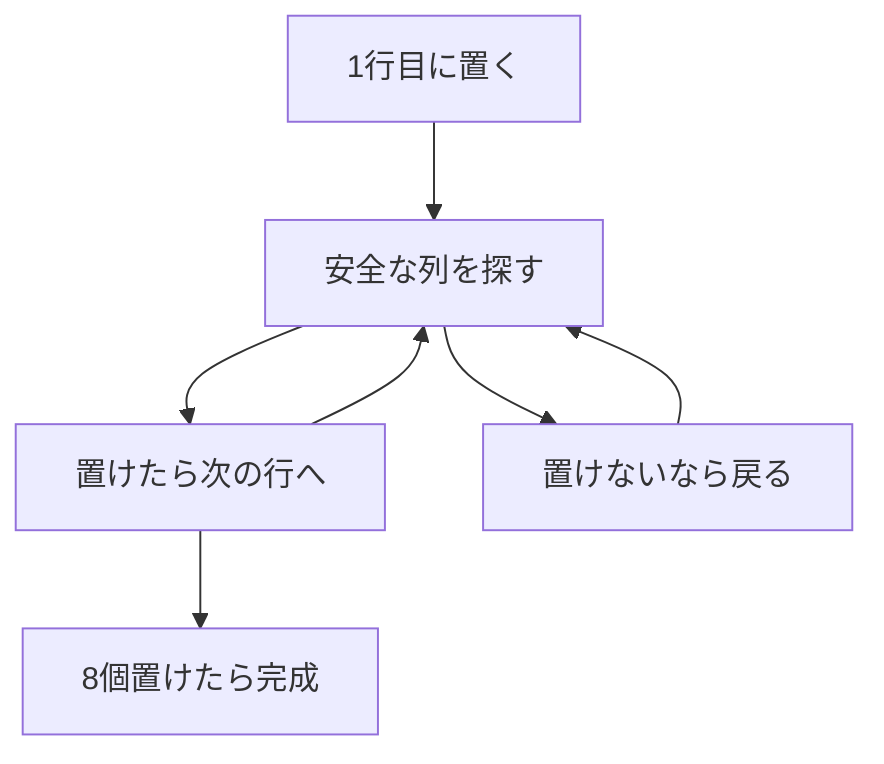

# 8クイーン問題: 置ける場所を試して戻ろう

8クイーン問題は、8×8のチェス盤に8個のクイーンを置き、どのクイーンも互いに取られないようにするパズルです。

クイーンは縦、横、斜めに動けます。つまり、同じ列や斜めに別のクイーンがある場所には置けません。

## 使いどころ

- 条件を満たす配置を探す問題
- 再帰関数の練習
- ダメなら一つ前に戻る「バックトラッキング」の理解

## 手順

1. 上の行から順番にクイーンを置く
2. その列と斜めが安全か調べる
3. 置けるなら次の行へ進む
4. 進めなくなったら、前の行へ戻って別の列を試す

## 図で見る



## コピペ用コード

```python
N = 8
board = [-1] * N


def is_safe(row, col):
    for r in range(row):
        c = board[r]
        if c == col:
            return False
        if abs(row - r) == abs(col - c):
            return False
    return True


def solve(row=0):
    if row == N:
        return True

    for col in range(N):
        if is_safe(row, col):
            board[row] = col
            if solve(row + 1):
                return True
            board[row] = -1

    return False


solve()
print(board)
```

## コードの読み方

- `board[row] = col` は、その行のどの列にクイーンを置いたかを表します。
- `is_safe()` で、同じ列と斜めにクイーンがいないか確認します。
- `solve(row + 1)` が失敗したら、`board[row] = -1` で置く前の状態に戻します。

## AOJで挑戦してみよう！

<div className="aojChallenge">
  <p className="aojChallenge__message">学んだレシピを実際に使って、ジャッジから「Accepted（正解）」を勝ち取ろう！</p>
  <div className="aojChallenge__links">
    <a className="aojChallenge__button" href="https://judge.u-aizu.ac.jp/onlinejudge/description.jsp?id=ALDS1_13_A&lang=ja" target="_blank" rel="noopener noreferrer">
      <span className="aojChallenge__label">ALDS1_13_A: 8-Queens Problem</span>
      <span className="aojChallenge__icon" aria-hidden="true">↗</span>
    </a>
  </div>
</div>
