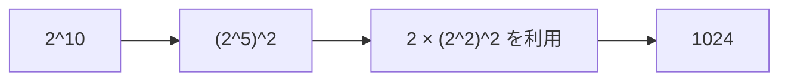

# 累乗: くり返し二乗法で高速に計算しよう

くり返し二乗法は、同じ数を何度もかける代わりに、指数を半分にしながら累乗を求める方法です。

`2^10` を `2` を10回かけて求めるのではなく、`2^2`、`2^4`、`2^8` のように倍々で作ります。

## 使いどころ

- 大きな累乗を高速に計算する
- 余りを取りながら累乗を求める
- 組み合わせ計算や暗号の基礎

## 手順

1. 指数が奇数なら、答えに今の底をかける
2. 底を2乗する
3. 指数を半分にする
4. 指数が0になるまでくり返す

## 図で見る



## コピペ用コード

```python
def fast_power(base, exponent):
    result = 1
    while exponent > 0:
        if exponent % 2 == 1:
            result *= base
        base *= base
        exponent //= 2
    return result

print(fast_power(2, 10))
```

## コードの読み方

- `exponent % 2 == 1` は、今の底を答えに使うかどうかの判定です。
- `base *= base` で、`2, 4, 16, 256...` のように底を大きくします。
- `exponent //= 2` で、指数を半分にしています。

## 計算量

普通にかけると `O(n)` ですが、くり返し二乗法では `O(log n)` になります。

## AOJで挑戦してみよう！

<div className="aojChallenge">
  <p className="aojChallenge__message">学んだレシピを実際に使って、ジャッジから「Accepted（正解）」を勝ち取ろう！</p>
  <div className="aojChallenge__links">
    <a className="aojChallenge__button" href="https://judge.u-aizu.ac.jp/onlinejudge/description.jsp?id=NTL_1_B&lang=ja" target="_blank" rel="noopener noreferrer">
      <span className="aojChallenge__label">NTL_1_B: Power</span>
      <span className="aojChallenge__icon" aria-hidden="true">↗</span>
    </a>
  </div>
</div>
