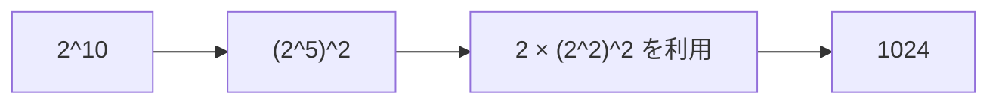

# 累乗: くり返し二乗法で高速に計算しよう

くり返し二乗法は、同じ数を何度もかける代わりに、指数を半分にしながら累乗を求める方法です。

`2^10` を `2` を10回かけて求めるのではなく、`2^2`、`2^4`、`2^8` のように倍々で作ります。

## 使いどころ

- 大きな累乗を高速に計算する
- 余りを取りながら累乗を求める
- 組み合わせ計算や暗号の基礎

## 手順

1. 指数が奇数なら、答えに今の底をかける
2. 底を2乗する
3. 指数を半分にする
4. 指数が0になるまでくり返す

## 図で見る



## コピペ用コード

```python
def fast_power(base, exponent):
    result = 1
    while exponent > 0:
        if exponent % 2 == 1:
            result *= base
        base *= base
        exponent //= 2
    return result

print(fast_power(2, 10))
```

## コードの読み方

- `exponent % 2 == 1` は、今の底を答えに使うかどうかの判定です。
- `base *= base` で、`2, 4, 16, 256...` のように底を大きくします。
- `exponent //= 2` で、指数を半分にしています。

## 計算量

普通にかけると `O(n)` ですが、くり返し二乗法では `O(log n)` になります。

| 指数 | 普通のかけ算 | くり返し二乗法 |
| :--- | :--- | :--- |
| 2^10 | 10回 | 約4回 |
| 2^1000 | 1000回 | 約10回 |
| 2^(10^18) | 現実的に不可能 | 約60回 |

## 別パターン1: 余りを取りながら計算する

競技プログラミングの定番「答えを 10^9+7 で割った余りで求めよ」に対応した形です。

```python
def fast_power_mod(base, exponent, mod):
    result = 1
    base %= mod
    while exponent > 0:
        if exponent % 2 == 1:
            result = result * base % mod
        base = base * base % mod
        exponent //= 2
    return result

MOD = 10 ** 9 + 7
print(fast_power_mod(2, 10 ** 18, MOD))
```

- かけ算のたびに `% mod` を入れることで、数が巨大になりすぎるのを防ぎます。
- `10^18` 乗のような途方もない指数でも、約60回のループで終わります。
- この計算は[公開鍵暗号](/docs/algorithms/public-key-cryptography/)や[組み合わせ計算の逆元](/docs/algorithms/combination/)の土台になっています。

## 別パターン2: 組み込みの pow を使う

Python の組み込み `pow` は、くり返し二乗法を内蔵しています。実戦ではこれで十分です。

```python
MOD = 10 ** 9 + 7

print(pow(2, 10))            # 1024 (普通の累乗)
print(pow(2, 10 ** 18, MOD)) # 第3引数に mod を渡せる
print(pow(3, -1, MOD))       # 逆元 (3 で割る代わりに掛ける数)
```

- `pow(base, exponent, mod)` の3引数版は、内部で余りを取りながら高速に計算してくれます。
- `pow(x, -1, mod)` は「mod の世界での 1/x（逆元）」です。余りの世界の割り算に使います。

## 別パターン3: 再帰で書く

「x^n は (x^(n/2))²」という関係を、[再帰関数](/docs/algorithms/recursion/)でそのまま書いた形です。

```python
def fast_power_recursive(base, exponent):
    if exponent == 0:
        return 1
    half = fast_power_recursive(base, exponent // 2)
    if exponent % 2 == 0:
        return half * half
    return half * half * base

print(fast_power_recursive(2, 10))  # 1024
```

- `exponent == 0` のとき `1` を返すのが止まる条件です。
- 偶数乗なら `half²`、奇数乗なら `half² × base` です。数学の式とコードが同じ形になるので、仕組みの理解に向いています。

## よくあるミス

| ミス | 何が起きるか | 対処 |
| :--- | :--- | :--- |
| mod 版で最後だけ余りを取る | 途中の数が巨大になり極端に遅くなる | かけ算のたびに `% mod` |
| `exponent % 2` の判定を忘れる | 奇数乗で答えがずれる | 「奇数のときだけ result に掛ける」を確認 |
| 自作にこだわる | バグの元 | 実戦は組み込み `pow` を使い、自作は理解用と割り切る |

## AOJで挑戦してみよう！

<div className="aojChallenge">
  <p className="aojChallenge__message">学んだレシピを実際に使って、ジャッジから「Accepted（正解）」を勝ち取ろう！</p>
  <div className="aojChallenge__links">
    <a className="aojChallenge__button" href="https://judge.u-aizu.ac.jp/onlinejudge/description.jsp?id=NTL_1_B&lang=ja" target="_blank" rel="noopener noreferrer">
      <span className="aojChallenge__label">NTL_1_B: Power</span>
      <span className="aojChallenge__icon" aria-hidden="true">↗</span>
    </a>
  </div>
</div>
