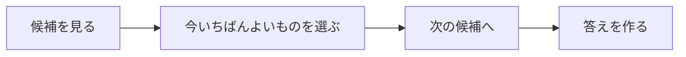

# 貪欲法: 今いちばんよい選択を積み重ねよう

貪欲法は、その時点で一番よさそうな選択をくり返す方法です。

おつりを出すときに、大きい硬貨から使うような考え方です。

## 使いどころ

- 硬貨の枚数を減らす
- 締切がある作業を選ぶ
- 区間をできるだけ多く選ぶ
- 毎回の最善が全体の最善につながる問題

## 手順

1. 候補を見比べる
2. 今一番よいものを選ぶ
3. 選んだ結果を反映する
4. 次の候補で同じことをくり返す

## 図で見る



## コピペ用コード

```python
coins = [100, 50, 10, 1]
amount = 186
count = 0

for coin in coins:
    count += amount // coin
    amount %= coin

print(count)
```

## コードの読み方

- `coins` は大きい順に並んでいます。
- `amount // coin` で、その硬貨を何枚使えるか計算します。
- `amount %= coin` で、残りの金額に更新します。

## 注意点

貪欲法はいつでも正しいとは限りません。「今の最善」が「全体の最善」になる理由を説明できるときに使います。
