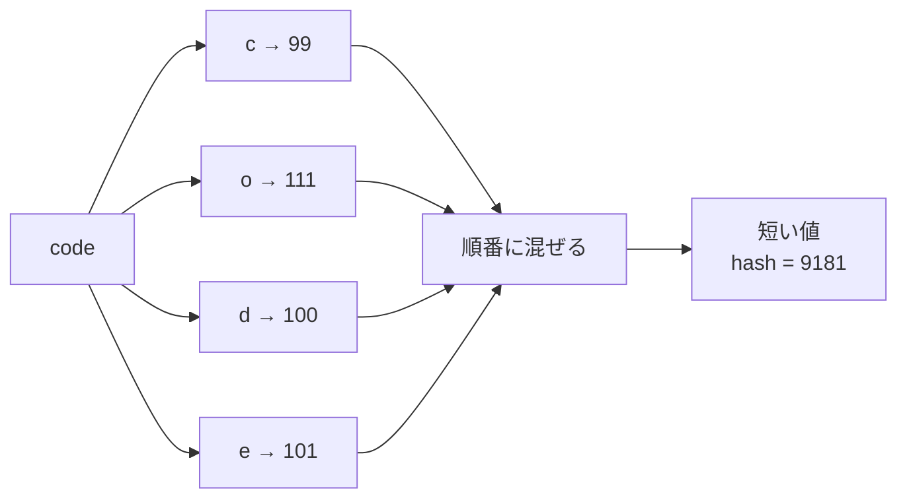

# ハッシュ関数: 長いデータに短いあだ名をつけよう

ハッシュ関数は、文字列やデータを、決まった計算で短い値に変える方法です。

長い名前に「あだ名」をつけるように、データを比べやすい形に変えます。ただし、違うデータが同じ値になることもあり、これを衝突と呼びます。

## ルール

1. 文字を1つずつ数字に変える
2. それまでの結果に混ぜる
3. 大きくなりすぎないように余りを使う
4. 最後に出た値をハッシュ値にする

## 図で見る



## コピペ用コード

```python
def simple_hash(text):
    result = 0

    for character in text:
        result = (result * 31 + ord(character)) % 10000

    return result

print(simple_hash("code"))    # 9181
print(simple_hash("recipe"))  # 2622
```

## コードの読み方

- `ord(character)` は、文字を数字（文字コード）に変えます。たとえば `"c"` は `99` です。
- `result * 31 + ord(character)` で、「これまでの結果」に新しい文字を混ぜ込みます。`31` のような素数を使うと、値が散らばりやすくなります。
- `% 10000` で余りを取り、値が大きくなりすぎないようにしています。この例ではハッシュ値は `0`〜`9999` の範囲に収まります。

## 使いどころ

- 辞書（`dict`）や集合（`set`）の内部で、データを高速に探す
- 長い文字列同士が同じかどうかを、短い値の比較で済ませる（[ローリングハッシュ](/docs/algorithms/rolling-hash/)）
- パスワードをそのまま保存しない仕組み
- ファイルが壊れていないかの確認（チェックサム）

## 別パターン1: Python標準の hash 関数

Python には組み込みの `hash()` があり、辞書や集合はこれを内部で使っています。

```python
print(hash("code"))
print(hash("recipe"))
print(hash((1, 2, 3)))  # タプルもハッシュ化できる
```

- 文字列、数値、タプルなどはハッシュ化できます。
- リストは中身を変更できる（ミュータブルな）データなのでハッシュ化できず、辞書のキーにも使えません。
- セキュリティ上の理由で、文字列の `hash()` の値は **Python を起動し直すと変わります**。値を保存して使い回す用途には向きません。

## 別パターン2: hashlib で安定したハッシュ値を作る

起動のたびに変わらない、安定したハッシュ値が必要なときは `hashlib` を使います。

```python
import hashlib

text = "code recipe"
digest = hashlib.sha256(text.encode()).hexdigest()

print(digest)
```

- `sha256` は暗号学的ハッシュ関数と呼ばれ、ファイルの改ざん検知やパスワード保存の基礎に使われます。
- `text.encode()` で文字列をバイト列に変換してから渡します。
- 同じ入力からは、いつでもどの環境でも同じ値が出ます。

## 衝突とは

違うデータから同じハッシュ値が出ることを **衝突** と呼びます。

```python
# simple_hash は 0〜9999 の 10000 通りしかないので、
# 10001 種類の文字列を入れれば必ずどこかで衝突する
```

ハッシュ値の種類には限りがあるため、衝突を完全になくすことはできません。辞書などの実際のデータ構造は、衝突が起きたときの逃げ道（同じ場所に複数持つなど）を用意して動いています。

## よくあるミス

| ミス | 何が起きるか | 対処 |
| :--- | :--- | :--- |
| `hash()` の値をファイルに保存して使い回す | 再起動後に一致しなくなる | `hashlib` を使う |
| ハッシュ値が同じ＝データも同じと考える | 衝突を見落とす | 必要なら元データ同士も比較する |
| リストを辞書のキーにする | `TypeError` で止まる | タプルに変換してから使う |
