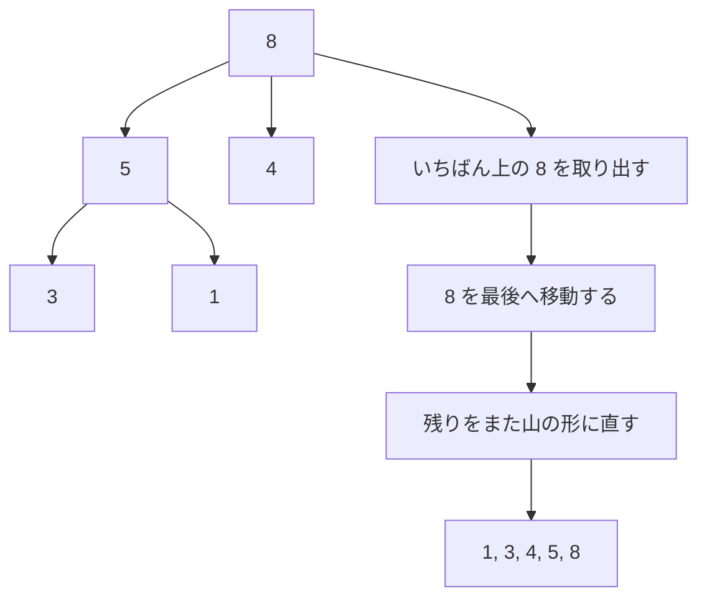

# ヒープソート: 山のルールで最大値を取り出そう

ヒープソートは、「親の数字は子どもの数字以上」という山のルールを作って、いちばん大きい数字を何度も取り出す並び替えです。

少しむずかしいですが、大きな数字をすばやく見つけるための考え方を学べます。

## ルール

1. 数字をヒープという形に並べる
2. いちばん大きい数字を後ろへ移動する
3. 残った数字でヒープの形を直す
4. これをくり返す

## 図で見る



## コピペ用コード

```python
def heap_sort(numbers):
    result = numbers[:]

    def heapify(size, root):
        largest = root
        left = 2 * root + 1
        right = 2 * root + 2

        if left < size and result[left] > result[largest]:
            largest = left

        if right < size and result[right] > result[largest]:
            largest = right

        if largest != root:
            result[root], result[largest] = result[largest], result[root]
            heapify(size, largest)

    for i in range(len(result) // 2 - 1, -1, -1):
        heapify(len(result), i)

    for end in range(len(result) - 1, 0, -1):
        result[0], result[end] = result[end], result[0]
        heapify(end, 0)

    return result

print(heap_sort([5, 3, 8, 1, 4]))
```
