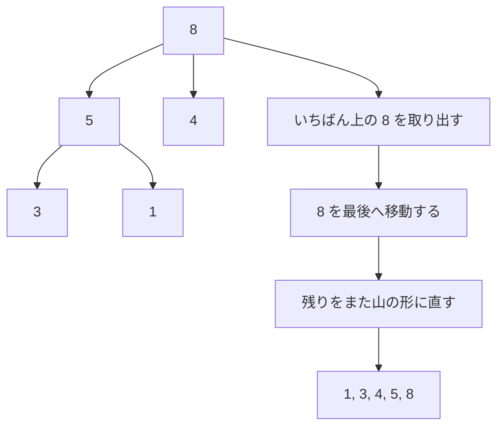

# ヒープソート: 山のルールで最大値を取り出そう

ヒープソートは、「親の数字は子どもの数字以上」という山のルールを作って、いちばん大きい数字を何度も取り出す並び替えです。

少しむずかしいですが、大きな数字をすばやく見つけるための考え方を学べます。

## ルール

1. 数字をヒープという形に並べる
2. いちばん大きい数字を後ろへ移動する
3. 残った数字でヒープの形を直す
4. これをくり返す

## 図で見る



## コピペ用コード

```python
def heap_sort(numbers):
    result = numbers[:]

    def heapify(size, root):
        largest = root
        left = 2 * root + 1
        right = 2 * root + 2

        if left < size and result[left] > result[largest]:
            largest = left

        if right < size and result[right] > result[largest]:
            largest = right

        if largest != root:
            result[root], result[largest] = result[largest], result[root]
            heapify(size, largest)

    for i in range(len(result) // 2 - 1, -1, -1):
        heapify(len(result), i)

    for end in range(len(result) - 1, 0, -1):
        result[0], result[end] = result[end], result[0]
        heapify(end, 0)

    return result

print(heap_sort([5, 3, 8, 1, 4]))
```

## コードの読み方

- `result = numbers[:]` で元のリストをコピーし、元データを壊さないようにしています。
- ヒープは配列で表現できます。`root` 番目の子どもは `2 * root + 1`（左）と `2 * root + 2`（右）です。
- `heapify(size, root)` は、「親が子より小さければ入れ替えて、山のルールを直す」関数です。入れ替えた先でもルールが崩れているかもしれないので、再帰でさらに下を直します。
- 最初のループ（`len(result) // 2 - 1` から逆順）で、配列全体を一度ヒープの形にします。子を持つ節だけを下から順に直すのがコツです。
- 2つ目のループで、「一番大きい先頭を末尾と交換 → 残りでヒープを直す」をくり返すと、後ろから順に大きい値が確定していきます。

## 計算量

| ソート | 平均 | 最悪 | 追加メモリ |
| :--- | :--- | :--- | :--- |
| ヒープソート | O(n log n) | **O(n log n)** | O(1)（その場で並べ替え） |
| クイックソート | O(n log n) | O(n²) | O(log n) |
| マージソート | O(n log n) | O(n log n) | O(n) |

ヒープソートの強みは、**最悪でも O(n log n)** で、追加メモリがほぼ不要なことです。実際の速度は[クイックソート](/docs/algorithms/quick-sort/)に負けることが多いですが、「最悪ケースの保証」が必要な場面で選ばれます。

## 別パターン1: heapq で「小さい順に取り出す」

Python 標準の `heapq` は最小ヒープです。ソートだけでなく「常に最小値がほしい」場面で活躍します。

```python
import heapq

numbers = [5, 3, 8, 1, 4]
heapq.heapify(numbers)  # リストをその場でヒープ化 O(n)

sorted_result = []
while numbers:
    sorted_result.append(heapq.heappop(numbers))  # 最小値を取り出す

print(sorted_result)  # [1, 3, 4, 5, 8]
```

- `heapify` は配列を一気にヒープへ変換します。
- `heappop` は最小値を取り出しつつ、山のルールを自動で直します。
- 「取り出すたびに最小値」という性質は、[優先度付きキュー](/docs/algorithms/priority-queue/)や[ダイクストラ法](/docs/algorithms/dijkstra/)の土台です。

## 別パターン2: 大きい順ベスト3だけほしい

全部並べ替えなくても、上位・下位の一部だけなら `heapq` の専用関数が便利です。

```python
import heapq

scores = [72, 91, 45, 88, 60, 95, 83]

print(heapq.nlargest(3, scores))   # [95, 91, 88]
print(heapq.nsmallest(3, scores))  # [45, 60, 72]
```

- `nlargest(k, data)` は O(n log k) で動きます。データが100万件でも上位3件だけなら、全ソートよりずっと速く済みます。
- ランキング表示や「ワースト◯件の抽出」にそのまま使えます。

## よくあるミス

| ミス | 何が起きるか | 対処 |
| :--- | :--- | :--- |
| 子の添字を `2 * root` と書く | 0始まりの配列ではズレる | 0始まりは `2 * root + 1` と `2 * root + 2` |
| `heapify` の範囲に取り出し済みの末尾を含める | 確定した値がまた動いてしまう | 2つ目のループでは `heapify(end, 0)` と範囲を縮める |
| `heapq` で最大ヒープのつもりで使う | 最小値が出てきて混乱する | 値の符号を反転して入れるか、`nlargest` を使う |
