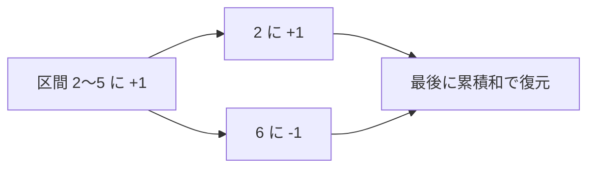

# いもす法: まとめて足して最後に復元しよう

いもす法は、区間全体に同じ値を足す処理を、始まりと終わりだけに記録して最後に復元する方法です。

予定表に「この日から増える」「この日の次から戻る」とだけメモして、最後に左から足し合わせるイメージです。

## 使いどころ

- 区間への加算がたくさんある
- どの日に何人いるかを求める
- 2次元の塗りつぶし問題の基礎

## 手順

1. 区間の始まりに `+1` を置く
2. 区間の終わりの次に `-1` を置く
3. 最後に左から累積和を取る
4. 各場所の本当の値が分かる

## 図で見る



## コピペ用コード

```python
size = 8
diff = [0] * (size + 1)

left, right = 2, 5
diff[left] += 1
diff[right + 1] -= 1

current = 0
for i in range(size):
    current += diff[i]
    print(i, current)
```

## コードの読み方

- `diff[left] += 1` は、ここから増えるという意味です。
- `diff[right + 1] -= 1` は、ここから元に戻るという意味です。
- `current += diff[i]` で、実際の値を復元しています。

## 計算量

| 方法 | 区間加算Q回＋全体の確認 |
| :--- | :--- |
| 毎回区間を全部足す | O(nQ) |
| いもす法 | O(n + Q) |

区間加算が何万回あっても、記録は1回につき2箇所だけ。最後に一度だけ累積和を取れば、全部の結果が出ます。

## 別パターン1: 複数の区間をまとめて処理する

「イベントの参加時間帯」のような複数区間を一気に処理する、いもす法の本領です。

```python
size = 10
diff = [0] * (size + 1)

# (開始, 終了) の予定リスト。終了時刻も含む
events = [(1, 4), (2, 6), (5, 8), (2, 3)]

for left, right in events:
    diff[left] += 1
    diff[right + 1] -= 1

counts = []
current = 0
for i in range(size):
    current += diff[i]
    counts.append(current)

print(counts)          # [0, 1, 3, 3, 2, 2, 2, 1, 1, 0]
print(max(counts))     # 3 (一番混んでいる時間帯の人数)
```

- 予定が何件あっても、ループの中でやることは `+1` と `-1` の記録だけです。
- 最後の累積和で「各時刻に何人いるか」が一度に分かります。
- `max(counts)` で「最大同時人数」が出ます。会議室の必要数や混雑判定に使える形です。

## 別パターン2: 2次元のいもす法

長方形領域への加算も、四隅への記録だけで処理できます。

```python
height, width = 5, 5
diff = [[0] * (width + 1) for _ in range(height + 1)]

# 長方形 (r1, c1)〜(r2, c2) に +1 (両端含む)
rectangles = [(0, 0, 2, 2), (1, 1, 3, 3)]

for r1, c1, r2, c2 in rectangles:
    diff[r1][c1] += 1
    diff[r1][c2 + 1] -= 1
    diff[r2 + 1][c1] -= 1
    diff[r2 + 1][c2 + 1] += 1

# 横方向 → 縦方向の順に累積和で復元
for r in range(height):
    for c in range(1, width):
        diff[r][c] += diff[r][c - 1]
for c in range(width):
    for r in range(1, height):
        diff[r][c] += diff[r - 1][c]

for r in range(height):
    print(diff[r][:width])
```

- 四隅の符号は「+1、-1、-1、+1」です。引きすぎた分を右下で1回戻す、と覚えます。
- 復元は横方向の累積和と縦方向の累積和を順にかけます。

## 累積和との関係

いもす法は[累積和](/docs/algorithms/prefix-sum/)の逆の操作です。

| 手法 | 前準備 | 知りたいこと |
| :--- | :--- | :--- |
| 累積和 | 合計をメモ | 区間の合計 |
| いもす法 | 差分をメモ | 各地点の値（区間加算後） |

「区間の合計を何度も聞かれる」なら累積和、「区間への加算が何度もある」ならいもす法、と使い分けます。

## よくあるミス

| ミス | 何が起きるか | 対処 |
| :--- | :--- | :--- |
| `-1` を `right` に置く | 区間の最後が反映されない | 「終わりの**次**」に置く |
| 配列の長さを `size` のままにする | `right + 1` で範囲外エラー | `size + 1` で確保する |
| 復元（累積和）を忘れる | 差分のままの値を答えにしてしまう | 最後に必ず累積和を取る |

## 注意点

終わりの次に `-1` を置くため、配列を1つ余分に用意しておくと安全です。
