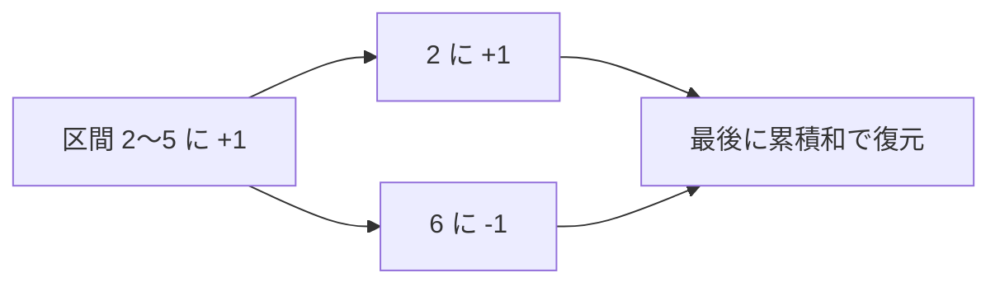

# いもす法: まとめて足して最後に復元しよう

いもす法は、区間全体に同じ値を足す処理を、始まりと終わりだけに記録して最後に復元する方法です。

予定表に「この日から増える」「この日の次から戻る」とだけメモして、最後に左から足し合わせるイメージです。

## 使いどころ

- 区間への加算がたくさんある
- どの日に何人いるかを求める
- 2次元の塗りつぶし問題の基礎

## 手順

1. 区間の始まりに `+1` を置く
2. 区間の終わりの次に `-1` を置く
3. 最後に左から累積和を取る
4. 各場所の本当の値が分かる

## 図で見る



## コピペ用コード

```python
size = 8
diff = [0] * (size + 1)

left, right = 2, 5
diff[left] += 1
diff[right + 1] -= 1

current = 0
for i in range(size):
    current += diff[i]
    print(i, current)
```

## コードの読み方

- `diff[left] += 1` は、ここから増えるという意味です。
- `diff[right + 1] -= 1` は、ここから元に戻るという意味です。
- `current += diff[i]` で、実際の値を復元しています。

## 注意点

終わりの次に `-1` を置くため、配列を1つ余分に用意しておくと安全です。
