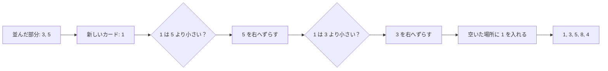

# 挿入ソート: 手札をそろえるように並べよう

挿入ソートは、左側を「もう並んでいる場所」と考えて、新しい数字をちょうどよい場所へ差し込む並び替えです。

トランプの手札を小さい順にそろえるとき、1枚ずつ正しい位置へ入れていく動きに似ています。

## ルール

1. 左から2枚目の数字を見る
2. 左側の並んでいる数字と比べる
3. 入るべき場所まで数字をずらす
4. 空いた場所へ数字を入れる

## 図で見る



## コピペ用コード

```python
def insertion_sort(numbers):
    result = numbers[:]

    for i in range(1, len(result)):
        current = result[i]
        j = i - 1

        while j >= 0 and result[j] > current:
            result[j + 1] = result[j]
            j -= 1

        result[j + 1] = current

    return result


print(insertion_sort([5, 3, 8, 1, 4]))
```

## 問いかけ

すでにほとんど並んでいる数字なら、挿入ソートは速そうでしょうか？それとも遅そうでしょうか？
