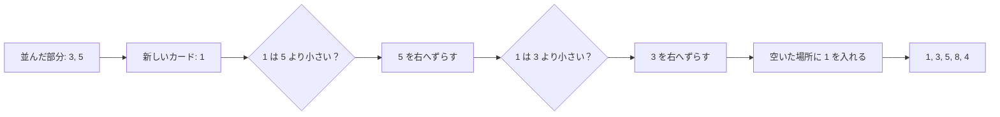

# 挿入ソート: 手札をそろえるように並べよう

挿入ソートは、左側を「もう並んでいる場所」と考えて、新しい数字をちょうどよい場所へ差し込む並び替えです。

トランプの手札を小さい順にそろえるとき、1枚ずつ正しい位置へ入れていく動きに似ています。

## ルール

1. 左から2枚目の数字を見る
2. 左側の並んでいる数字と比べる
3. 入るべき場所まで数字をずらす
4. 空いた場所へ数字を入れる

## 図で見る



## コピペ用コード

```python
def insertion_sort(numbers):
    result = numbers[:]

    for i in range(1, len(result)):
        current = result[i]
        j = i - 1

        while j >= 0 and result[j] > current:
            result[j + 1] = result[j]
            j -= 1

        result[j + 1] = current

    return result

print(insertion_sort([5, 3, 8, 1, 4]))
```

## コードの読み方

- `current = result[i]` で、今から差し込むカードを取り出して覚えておきます。
- `while j >= 0 and result[j] > current` の間、`current` より大きい数を1つずつ右へずらします。
- ずらし終わった空きスペース（`j + 1`）に `current` を入れます。「入れ替え」ではなく「ずらして差し込む」のがポイントです。

## 計算量

挿入ソートは、データの並び具合で速さが大きく変わります。

| 状態 | 計算量 |
| :--- | :--- |
| すでに並んでいる | **O(n)**（各要素を1回見るだけ） |
| ランダム | O(n²) |
| 逆順 | O(n²)（毎回一番左までずらす） |

「ほぼ並んでいるデータに追加があった」ような場面では、高速なソートよりも速いことがあります。実際、多くの言語の標準ソートは、小さい区間の処理に挿入ソートを内部で使っています。

## 別パターン1: bisect で差し込む場所を二分探索する

「どこに入れるか」を[二分探索](/docs/algorithms/binary-search/)で探す改良版です。ソート済みリストに値を追加していく用途では、この形が実用的です。

```python
import bisect

sorted_list = []
for value in [5, 3, 8, 1, 4]:
    bisect.insort(sorted_list, value)
    print(sorted_list)

# [5]
# [3, 5]
# [3, 5, 8]
# [1, 3, 5, 8]
# [1, 3, 4, 5, 8]
```

- `bisect.insort(リスト, 値)` は、ソート済みリストの正しい位置に値を差し込みます。
- 場所探しは O(log n) になりますが、差し込みでのずらしは O(n) のままです。それでも比較回数が減るぶん速くなります。
- 「常にソート済みの状態を保ちたいリスト」（ランキングなど）にそのまま使えます。

## 別パターン2: タプルを特定のキーで並べる

実際のデータは数字だけではありません。（名前, 点数）のペアを点数順に並べる例です。

```python
def insertion_sort_by_score(records):
    result = records[:]

    for i in range(1, len(result)):
        current = result[i]
        j = i - 1

        while j >= 0 and result[j][1] > current[1]:  # 点数(添字1)で比較
            result[j + 1] = result[j]
            j -= 1

        result[j + 1] = current

    return result

records = [("ゆい", 72), ("けん", 91), ("さき", 45), ("たく", 88)]
print(insertion_sort_by_score(records))
# [('さき', 45), ('ゆい', 72), ('たく', 88), ('けん', 91)]
```

- 比較を `result[j][1] > current[1]` にして、タプルの2番目（点数）で並べています。
- 挿入ソートは **安定ソート**（同じ点数なら元の順番を保つ）なので、「点数が同じなら受付順」のような要件にも自然に対応できます。

## よくあるミス

| ミス | 何が起きるか | 対処 |
| :--- | :--- | :--- |
| `while` の条件から `j >= 0` を外す | 先頭より左を見て `result[-1]` を壊す | 範囲チェックを必ず入れる |
| `result[j] >= current` にする | 動くが安定ソートでなくなる | 同じ値を追い越さない `>` を使う |
| `current` を使わず毎回入れ替える | 動くが代入回数が約3倍になる | 「覚えて、ずらして、差し込む」の形にする |

## AOJで挑戦してみよう！

<div className="aojChallenge">
  <p className="aojChallenge__message">学んだレシピを実際に使って、ジャッジから「Accepted（正解）」を勝ち取ろう！</p>
  <div className="aojChallenge__links">
    <a className="aojChallenge__button" href="https://judge.u-aizu.ac.jp/onlinejudge/description.jsp?id=ALDS1_1_A&lang=ja" target="_blank" rel="noopener noreferrer">
      <span className="aojChallenge__label">ALDS1_1_A: Insertion Sort</span>
      <span className="aojChallenge__icon" aria-hidden="true">↗</span>
    </a>
  </div>
</div>
