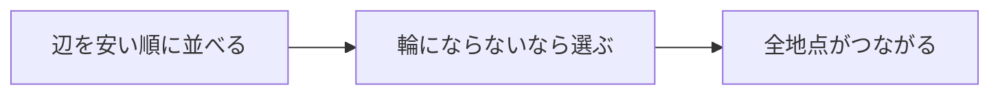

# クラスカル法: 安い道から選んで全体をつなごう

クラスカル法は、コストの小さい辺から順に選び、輪っかを作らないように全体をつなぐ方法です。

すべての町を道路でつなぎたいけれど、工事費はできるだけ安くしたい、という場面を考えると分かりやすいです。

## 使いどころ

- 最小全域木を作る
- 全地点を最小コストでつなぐ
- Union-Findの実用例を学ぶ

## 手順

1. 辺をコストの小さい順に並べる
2. 安い辺から順に見る
3. その辺を選んで輪っかができないなら採用する
4. 全ての地点がつながったら完成

## 図で見る



## コピペ用コード

```python
edges = [(1, 0, 1), (2, 1, 2), (3, 0, 2)]
parent = [0, 1, 2]

def find(x):
    if parent[x] != x:
        parent[x] = find(parent[x])
    return parent[x]

total = 0
for cost, a, b in sorted(edges):
    if find(a) != find(b):
        parent[find(a)] = find(b)
        total += cost

print(total)
```

## コードの読み方

- `sorted(edges)` で、辺をコスト順に見ています。
- `find(a) != find(b)` なら、まだ別グループなのでつないでも輪っかになりません。
- 採用した辺のコストを `total` に足しています。

## 注意点

クラスカル法では、輪っかを作らない判定が大切です。そのためにUnion-Findがよく使われます。

## AOJで挑戦してみよう！

<div className="aojChallenge">
  <p className="aojChallenge__message">学んだレシピを実際に使って、ジャッジから「Accepted（正解）」を勝ち取ろう！</p>
  <div className="aojChallenge__links">
    <a className="aojChallenge__button" href="https://judge.u-aizu.ac.jp/onlinejudge/description.jsp?id=ALDS1_12_A&lang=ja" target="_blank" rel="noopener noreferrer">
      <span className="aojChallenge__label">ALDS1_12_A: Minimum Spanning Tree</span>
      <span className="aojChallenge__icon" aria-hidden="true">↗</span>
    </a>
  </div>
</div>
