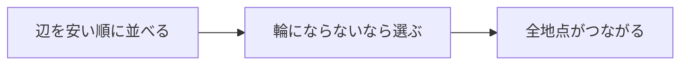

# クラスカル法: 安い道から選んで全体をつなごう

クラスカル法は、コストの小さい辺から順に選び、輪っかを作らないように全体をつなぐ方法です。

すべての町を道路でつなぎたいけれど、工事費はできるだけ安くしたい、という場面を考えると分かりやすいです。

## 使いどころ

- 最小全域木を作る
- 全地点を最小コストでつなぐ
- Union-Findの実用例を学ぶ

## 手順

1. 辺をコストの小さい順に並べる
2. 安い辺から順に見る
3. その辺を選んで輪っかができないなら採用する
4. 全ての地点がつながったら完成

## 図で見る



## コピペ用コード

```python
edges = [(1, 0, 1), (2, 1, 2), (3, 0, 2)]
parent = [0, 1, 2]

def find(x):
    if parent[x] != x:
        parent[x] = find(parent[x])
    return parent[x]

total = 0
for cost, a, b in sorted(edges):
    if find(a) != find(b):
        parent[find(a)] = find(b)
        total += cost

print(total)
```

## コードの読み方

- `sorted(edges)` で、辺をコスト順に見ています。
- `find(a) != find(b)` なら、まだ別グループなのでつないでも輪っかになりません。
- 採用した辺のコストを `total` に足しています。

## 計算量

クラスカル法の計算量は、辺のソートが支配的で **O(E log E)**（E: 辺の数）です。輪っか判定は [Union-Find](/docs/algorithms/union-find/) を使えば、1回あたりほぼ O(1) で済みます。

## 別パターン1: クラスと関数でまとめた実用形

Union-Find をクラスにし、採用した辺も記録する、そのまま提出できる形です。

```python
class UnionFind:
    def __init__(self, size):
        self.parent = list(range(size))

    def find(self, x):
        if self.parent[x] != x:
            self.parent[x] = self.find(self.parent[x])
        return self.parent[x]

    def union(self, a, b):
        root_a, root_b = self.find(a), self.find(b)
        if root_a == root_b:
            return False  # すでに同じグループ (輪っかになる)
        self.parent[root_a] = root_b
        return True

def kruskal(node_count, edges):
    uf = UnionFind(node_count)
    total = 0
    used_edges = []

    for cost, a, b in sorted(edges):
        if uf.union(a, b):
            total += cost
            used_edges.append((a, b, cost))

    return total, used_edges

# (コスト, 頂点a, 頂点b)
edges = [
    (1, 0, 1), (2, 1, 2), (3, 0, 2),
    (4, 2, 3), (5, 1, 3),
]

total, used = kruskal(4, edges)
print(total)  # 7 (1 + 2 + 4)
print(used)   # [(0, 1, 1), (1, 2, 2), (2, 3, 4)]
```

- `union()` が「合体できたか」を返すようにすると、輪っか判定と合体が1回で済みます。
- `used_edges` に採用した辺を残せば、「どの道路を工事すればよいか」まで答えられます。
- 頂点が n 個のとき、採用される辺はちょうど n - 1 本です。

## 別パターン2: 途中でやめると「グループ分け」になる

クラスカル法を途中（辺 k 本採用した時点）で止めると、「近いものどうしをつないだグループ分け（クラスタリング）」になります。

```python
class UnionFind:
    def __init__(self, size):
        self.parent = list(range(size))

    def find(self, x):
        if self.parent[x] != x:
            self.parent[x] = self.find(self.parent[x])
        return self.parent[x]

    def union(self, a, b):
        root_a, root_b = self.find(a), self.find(b)
        if root_a == root_b:
            return False
        self.parent[root_a] = root_b
        return True

def cluster(node_count, edges, group_count):
    uf = UnionFind(node_count)
    merged = 0

    for cost, a, b in sorted(edges):
        if node_count - merged == group_count:
            break  # 目的のグループ数になったら止める
        if uf.union(a, b):
            merged += 1

    groups = {}
    for node in range(node_count):
        groups.setdefault(uf.find(node), []).append(node)
    return list(groups.values())

edges = [
    (1, 0, 1), (2, 2, 3), (10, 1, 2),
]

print(cluster(4, edges, 2))  # [[0, 1], [2, 3]] (遠い辺10を使わず2グループ)
```

- 「一番コストの高い辺を使わない」＝「遠いものは別グループのまま」という発想です。
- データ分析のクラスタリング（単連結法）と同じ考え方で、最小全域木の面白い応用です。

## プリム法との使い分け

| 方法 | 進め方 | 向いている場面 |
| :--- | :--- | :--- |
| クラスカル法 | 辺を安い順に全体から選ぶ | 辺のリストで与えられる問題。実装が短い |
| [プリム法](/docs/algorithms/prim/) | 1点から木を広げる | 隣接リストで密なグラフ |

どちらも答え（最小全域木のコスト）は同じになります。

## よくあるミス

| ミス | 何が起きるか | 対処 |
| :--- | :--- | :--- |
| 輪っか判定を「直接つながっているか」で行う | 間接的な輪っかを見逃す | Union-Find で「同じグループか」を見る |
| `parent[a] = b` のように代表以外をつなぐ | グループ情報が壊れる | 必ず `find` した代表同士をつなぐ |
| 辺のタプルの順番を間違えてソートする | コスト順にならない | `(コスト, a, b)` の順にしてから `sorted` |

## 注意点

クラスカル法では、輪っかを作らない判定が大切です。そのためにUnion-Findがよく使われます。

## AOJで挑戦してみよう！

<div className="aojChallenge">
  <p className="aojChallenge__message">学んだレシピを実際に使って、ジャッジから「Accepted（正解）」を勝ち取ろう！</p>
  <div className="aojChallenge__links">
    <a className="aojChallenge__button" href="https://judge.u-aizu.ac.jp/onlinejudge/description.jsp?id=ALDS1_12_A&lang=ja" target="_blank" rel="noopener noreferrer">
      <span className="aojChallenge__label">ALDS1_12_A: Minimum Spanning Tree</span>
      <span className="aojChallenge__icon" aria-hidden="true">↗</span>
    </a>
  </div>
</div>
