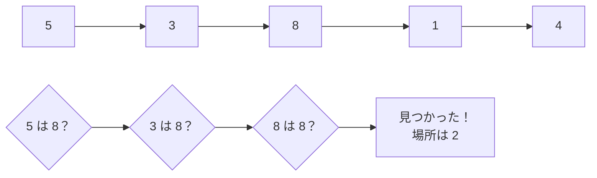

# 線形探索: 先頭から順番に探そう

線形探索は、リストの先頭から1つずつ見て、目的の値を探す方法です。

本棚の左から順番に、探している本のタイトルを確認していくイメージです。

## ルール

1. 先頭の数字を見る
2. 探している数字と同じか確認する
3. 違ったら次の数字へ進む
4. 見つかったら、その場所を答える

## 図で見る



## コピペ用コード

```python
def linear_search(numbers, target):
    for index, number in enumerate(numbers):
        if number == target:
            return index

    return -1

print(linear_search([5, 3, 8, 1, 4], 8))
```

## AOJで挑戦してみよう！

<div className="aojChallenge">
  <p className="aojChallenge__message">学んだレシピを実際に使って、ジャッジから「Accepted（正解）」を勝ち取ろう！</p>
  <div className="aojChallenge__links">
    <a className="aojChallenge__button" href="https://judge.u-aizu.ac.jp/onlinejudge/description.jsp?id=ALDS1_4_A&lang=ja" target="_blank" rel="noopener noreferrer">
      <span className="aojChallenge__label">ALDS1_4_A: Linear Search</span>
      <span className="aojChallenge__icon" aria-hidden="true">↗</span>
    </a>
  </div>
</div>
