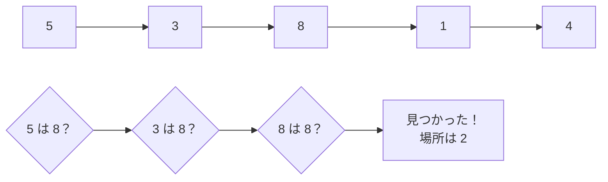

# 線形探索: 先頭から順番に探そう

線形探索は、リストの先頭から1つずつ見て、目的の値を探す方法です。

本棚の左から順番に、探している本のタイトルを確認していくイメージです。

## ルール

1. 先頭の数字を見る
2. 探している数字と同じか確認する
3. 違ったら次の数字へ進む
4. 見つかったら、その場所を答える

## 図で見る



## コピペ用コード

```python
def linear_search(numbers, target):
    for index, number in enumerate(numbers):
        if number == target:
            return index

    return -1

print(linear_search([5, 3, 8, 1, 4], 8))
```

## コードの読み方

- `enumerate(numbers)` は、「何番目か（index）」と「値（number）」をセットで取り出す書き方です。
- 目的の値と一致したら、その場で `return index` して探索を打ち切ります。最後まで見る必要はありません。
- ループを最後まで抜けたら見つからなかったということなので、`-1` を返します。

## 計算量

線形探索の計算量は **O(n)** です。データが `n` 個あれば、最悪の場合 `n` 回比較します。

| データの状態 | 比較回数 |
| :--- | :--- |
| 先頭にある | 1回 |
| 真ん中にある | 約 n/2 回 |
| 末尾にある・存在しない | n回 |

データが並んでいなくても使える代わりに、大量のデータでは遅くなります。ソート済みのデータなら[二分探索](/docs/algorithms/binary-search/)のほうが高速です。

## 別パターン1: Pythonらしい書き方

「あるかどうか」だけ知りたいときと、「位置」も知りたいときで、Python には便利な書き方があります。

```python
numbers = [5, 3, 8, 1, 4]

# あるかどうかだけ知りたい
print(8 in numbers)  # True

# 位置も知りたい
if 8 in numbers:
    print(numbers.index(8))  # 2
```

- `in` は、リストの中を先頭から順に調べる線形探索そのものです。
- `numbers.index(8)` は最初に見つかった位置を返します。ただし **存在しない値を渡すとエラー** になるので、`in` で確認してから使うと安全です。

## 別パターン2: 条件に合うものを探す

「値が一致するもの」ではなく、「条件に合う最初のもの」を探す形もよく使います。

```python
scores = [45, 72, 88, 60, 91]

def find_first(items, condition):
    for index, item in enumerate(items):
        if condition(item):
            return index
    return -1

# 80点以上を最初に取った位置
print(find_first(scores, lambda score: score >= 80))  # 2
```

- `condition` に関数を渡すことで、「80点以上」「偶数」など、探す条件を自由に変えられます。
- 探す条件が変わっても `find_first` 本体を書き換えなくてよいのがポイントです。

## よくあるミス

| ミス | 何が起きるか | 対処 |
| :--- | :--- | :--- |
| `numbers.index()` を存在チェックなしで使う | `ValueError` で止まる | 先に `in` で確認するか、`try` で囲む |
| 見つかったあともループを続ける | 無駄な比較で遅くなる | 見つかった時点で `return` や `break` |
| 戻り値 `-1` をそのまま添字に使う | `numbers[-1]` は末尾を指してしまう | `-1` かどうかを必ず確認する |

## AOJで挑戦してみよう！

<div className="aojChallenge">
  <p className="aojChallenge__message">学んだレシピを実際に使って、ジャッジから「Accepted（正解）」を勝ち取ろう！</p>
  <div className="aojChallenge__links">
    <a className="aojChallenge__button" href="https://judge.u-aizu.ac.jp/onlinejudge/description.jsp?id=ALDS1_4_A&lang=ja" target="_blank" rel="noopener noreferrer">
      <span className="aojChallenge__label">ALDS1_4_A: Linear Search</span>
      <span className="aojChallenge__icon" aria-hidden="true">↗</span>
    </a>
  </div>
</div>
