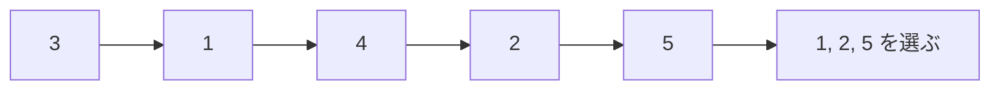

# 最長増加部分列: 増え続ける数字を抜き出そう

最長増加部分列、LISは、数字の列から順番を崩さずに、増え続ける数字をできるだけ長く抜き出す問題です。

隣同士である必要はありません。元の列の左から右への順番だけを守ります。

## 使いどころ

- 並びの中から成長している部分を探す
- 動的計画法と二分探索の応用
- コンテストでよく出る「列」の典型問題

## 手順

1. `tails` を用意する
2. 各長さの増加列について、最後の数字をできるだけ小さく保つ
3. 新しい数字を二分探索で入れる場所を探す
4. `tails` の長さが答えになる

## 図で見る



## コピペ用コード

```python
from bisect import bisect_left


def lis_length(numbers):
    tails = []

    for number in numbers:
        index = bisect_left(tails, number)
        if index == len(tails):
            tails.append(number)
        else:
            tails[index] = number

    return len(tails)


print(lis_length([3, 1, 4, 2, 5]))
```

## コードの読み方

- `tails[i]` は、長さ `i + 1` の増加列を作るときの最後の数字の候補です。
- `bisect_left()` で、今の数字を入れる場所を高速に探します。
- 小さい最後の数字を残すほど、次の数字をつなげやすくなります。

## 計算量

| 方法 | 計算量 | 特徴 |
| :--- | :--- | :--- |
| 二分探索版（上のコード） | **O(n log n)** | 速い。長さだけ求めるなら最良 |
| DP版（別パターン1） | O(n²) | 仕組みが分かりやすい。復元しやすい |

`tails` への挿入位置を[二分探索](/docs/algorithms/binary-search/)（`bisect_left`）で探すため、1つの数字あたり O(log n) で処理できます。

## 別パターン1: 動的計画法で書く（仕組みが見える版)

「なぜその答えになるのか」を理解するには、[動的計画法](/docs/algorithms/dynamic-programming/)の素直な書き方が分かりやすいです。

```python
def lis_length_dp(numbers):
    n = len(numbers)
    # dp[i] = numbers[i] で終わる増加列の最長の長さ
    dp = [1] * n

    for i in range(n):
        for j in range(i):
            if numbers[j] < numbers[i]:
                dp[i] = max(dp[i], dp[j] + 1)

    return max(dp)

print(lis_length_dp([3, 1, 4, 2, 5]))  # 3
```

- `dp[i]` は「i 番目の数字で終わる増加列の最長の長さ」です。
- 自分より前にあり、かつ自分より小さい数字 `numbers[j]` の後ろにつなげられます。
- 2重ループなので O(n²) ですが、数千個程度までなら十分動きます。

## 別パターン2: 実際の列を復元する

「長さ3」だけでなく「どの数字を選んだか」も知りたい場合は、DP版に「どこからつないだか」の記録を足します。

```python
def lis_with_path(numbers):
    n = len(numbers)
    dp = [1] * n
    previous = [-1] * n  # どの位置からつないだか

    for i in range(n):
        for j in range(i):
            if numbers[j] < numbers[i] and dp[j] + 1 > dp[i]:
                dp[i] = dp[j] + 1
                previous[i] = j

    # 最長の終端から逆にたどる
    best_end = dp.index(max(dp))
    path = []
    index = best_end
    while index != -1:
        path.append(numbers[index])
        index = previous[index]
    path.reverse()
    return path

print(lis_with_path([3, 1, 4, 2, 5]))  # [3, 4, 5] ([1, 2, 5] も同じ長さの正解)
print(lis_with_path([10, 20, 5, 30, 25, 40]))  # [10, 20, 30, 40]
```

- `previous[i]` に「1つ手前に選んだ位置」を残し、最後に逆にたどって反転します。
- 経路復元の考え方は[ダイクストラ法](/docs/algorithms/dijkstra/)の経路復元と同じパターンです。

## 別パターン3: 「以上」も許す（広義単調増加）

「同じ値が続いてもよい」場合は、`bisect_left` を `bisect_right` に変えるだけです。

```python
from bisect import bisect_right

def lis_non_decreasing(numbers):
    tails = []
    for number in numbers:
        index = bisect_right(tails, number)
        if index == len(tails):
            tails.append(number)
        else:
            tails[index] = number
    return len(tails)

print(lis_non_decreasing([1, 2, 2, 3]))  # 4 (1 ≤ 2 ≤ 2 ≤ 3)

# 比較: 狭義増加 (同じ値はつなげない) なら 3
from bisect import bisect_left

def lis_strict(numbers):
    tails = []
    for number in numbers:
        index = bisect_left(tails, number)
        if index == len(tails):
            tails.append(number)
        else:
            tails[index] = number
    return len(tails)

print(lis_strict([1, 2, 2, 3]))  # 3
```

- `bisect_left` は「同じ値の位置に上書き」するので同じ値をつなげません（狭義増加）。
- `bisect_right` は「同じ値の後ろに追加」するので同じ値もつなげます（広義増加）。
- 問題文の「増加」がどちらの意味か、必ず確認しましょう。

## よくあるミス

| ミス | 何が起きるか | 対処 |
| :--- | :--- | :--- |
| `tails` を「実際のLIS」だと思う | 中身は各長さの最小終端であり、LISそのものではない | 復元したいときは別パターン2を使う |
| `bisect_left` と `bisect_right` を取り違える | 同じ値の扱いが逆になり答えがずれる | 狭義なら left、広義なら right |
| DP版の初期値を 0 にする | 1個だけでも長さ1のはずが0になる | `dp = [1] * n` で初期化 |

## 注意点

このコードは長さを求める版です。実際の列そのものを復元したい場合は、前の位置を記録する配列も必要になります（別パターン2を参照）。

## AOJで挑戦してみよう！

<div className="aojChallenge">
  <p className="aojChallenge__message">学んだレシピを実際に使って、ジャッジから「Accepted（正解）」を勝ち取ろう！</p>
  <div className="aojChallenge__links">
    <a className="aojChallenge__button" href="https://judge.u-aizu.ac.jp/onlinejudge/description.jsp?id=DPL_1_D&lang=ja" target="_blank" rel="noopener noreferrer">
      <span className="aojChallenge__label">DPL_1_D: Longest Increasing Subsequence</span>
      <span className="aojChallenge__icon" aria-hidden="true">↗</span>
    </a>
  </div>
</div>
