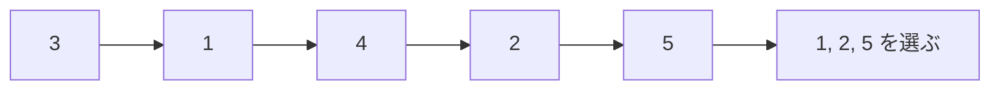

# 最長増加部分列: 増え続ける数字を抜き出そう

最長増加部分列、LISは、数字の列から順番を崩さずに、増え続ける数字をできるだけ長く抜き出す問題です。

隣同士である必要はありません。元の列の左から右への順番だけを守ります。

## 使いどころ

- 並びの中から成長している部分を探す
- 動的計画法と二分探索の応用
- コンテストでよく出る「列」の典型問題

## 手順

1. `tails` を用意する
2. 各長さの増加列について、最後の数字をできるだけ小さく保つ
3. 新しい数字を二分探索で入れる場所を探す
4. `tails` の長さが答えになる

## 図で見る



## コピペ用コード

```python
from bisect import bisect_left


def lis_length(numbers):
    tails = []

    for number in numbers:
        index = bisect_left(tails, number)
        if index == len(tails):
            tails.append(number)
        else:
            tails[index] = number

    return len(tails)


print(lis_length([3, 1, 4, 2, 5]))
```

## コードの読み方

- `tails[i]` は、長さ `i + 1` の増加列を作るときの最後の数字の候補です。
- `bisect_left()` で、今の数字を入れる場所を高速に探します。
- 小さい最後の数字を残すほど、次の数字をつなげやすくなります。

## 注意点

このコードは長さを求める版です。実際の列そのものを復元したい場合は、前の位置を記録する配列も必要になります。

## AOJで挑戦してみよう！

<div className="aojChallenge">
  <p className="aojChallenge__message">学んだレシピを実際に使って、ジャッジから「Accepted（正解）」を勝ち取ろう！</p>
  <div className="aojChallenge__links">
    <a className="aojChallenge__button" href="https://judge.u-aizu.ac.jp/onlinejudge/description.jsp?id=DPL_1_D&lang=ja" target="_blank" rel="noopener noreferrer">
      <span className="aojChallenge__label">DPL_1_D: Longest Increasing Subsequence</span>
      <span className="aojChallenge__icon" aria-hidden="true">↗</span>
    </a>
  </div>
</div>
