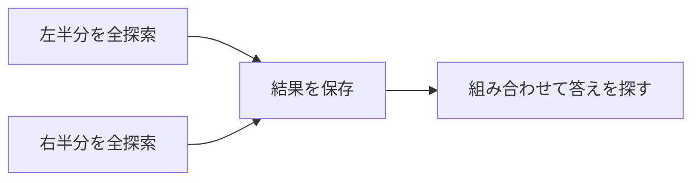

# 半分全列挙: 半分ずつ調べて組み合わせよう

半分全列挙は、全パターンを一気に調べる代わりに、半分ずつ列挙して後で組み合わせる方法です。

30個の全探索は大変ですが、15個ずつに分けると、それぞれの結果を組み合わせて考えられます。

## 使いどころ

- 全探索したいが数が少し多い
- 部分集合の合計を調べる
- 左半分と右半分を組み合わせられる問題

## 手順

1. データを半分に分ける
2. 左半分の全パターンを作る
3. 右半分の全パターンを作る
4. 2つの結果を組み合わせて答えを探す

## 図で見る



## コピペ用コード

```python
def subset_sums(numbers):
    sums = [0]
    for number in numbers:
        sums += [value + number for value in sums]
    return sums


numbers = [3, 5, 8, 10]
left = subset_sums(numbers[:2])
right = subset_sums(numbers[2:])
print(left, right)
```

## コードの読み方

- `subset_sums()` は、選んだ数の合計をすべて作る関数です。
- `sums += ...` で、今ある合計に新しい数を足した合計を追加しています。
- `left` と `right` を後で組み合わせることで、全体の候補を考えます。

## 注意点

半分全列挙は、全探索よりは軽くなりますが、それでも候補数は多いです。ソートや二分探索と組み合わせることがよくあります。

## 問いかけ

全部を一度に調べるより、半分に分けるとどんな工夫ができますか？
