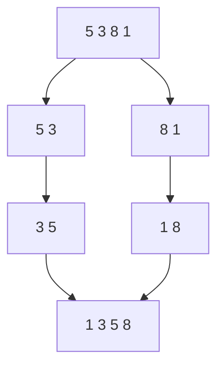

# マージソート: 小分けにしてから合体しよう

マージソートは、リストを半分ずつ分け、最後に小さい順になるよう合体する方法です。

バラバラにしたカードを、2つの山ごとに「小さいほうから先に出す」と考えると分かりやすいです。

## 使いどころ

- 大きなデータを安定して速く並べ替えたいとき
- 「分けて考える」再帰の練習をしたいとき
- クイックソートと違う考え方のソートを比べたいとき

## 手順

1. リストを半分に分ける
2. 左半分と右半分をそれぞれ並べ替える
3. 2つの並んだリストを、小さい順に合体する
4. 1つの並んだリストになったら完成

## 図で見る



## コピペ用コード

```python
def merge_sort(numbers):
    if len(numbers) <= 1:
        return numbers

    middle = len(numbers) // 2
    left = merge_sort(numbers[:middle])
    right = merge_sort(numbers[middle:])
    result = []

    while left and right:
        result.append(left.pop(0) if left[0] < right[0] else right.pop(0))

    return result + left + right

print(merge_sort([5, 3, 8, 1, 4]))
```

## コードの読み方

- `len(numbers) <= 1` は、もう分けなくてよい状態です。
- `left` と `right` は、それぞれ並び替え済みの小さなリストです。
- `while left and right` で、左と右の先頭を比べて小さいほうを取り出します。

## 計算量

マージソートは、分ける回数が少なく、合体では全体を1回ずつ見るため、だいたい `O(n log n)` で動きます。

| ソート | 平均 | 最悪 | 安定性 |
| :--- | :--- | :--- | :--- |
| マージソート | O(n log n) | **O(n log n)** | 安定 |
| [クイックソート](/docs/algorithms/quick-sort/) | O(n log n) | O(n²) | 不安定 |
| [ヒープソート](/docs/algorithms/heap-sort/) | O(n log n) | O(n log n) | 不安定 |

マージソートの強みは、**最悪でも O(n log n)** であることと、**安定ソート**（同じ値の元の順番を保つ）であることです。代わりに、合体用のリスト分だけ余分なメモリ（O(n)）を使います。

## 別パターン1: 添字で合体する（pop(0) を使わない）

最初のコードの `pop(0)` は、先頭を取り出すたびに残り全体をずらすため遅くなります。添字で読み進める書き方が実用形です。

```python
def merge_sort_fast(numbers):
    if len(numbers) <= 1:
        return numbers

    middle = len(numbers) // 2
    left = merge_sort_fast(numbers[:middle])
    right = merge_sort_fast(numbers[middle:])

    result = []
    i = j = 0
    while i < len(left) and j < len(right):
        if left[i] <= right[j]:
            result.append(left[i])
            i += 1
        else:
            result.append(right[j])
            j += 1

    result.extend(left[i:])   # 残りをまとめて追加
    result.extend(right[j:])
    return result

print(merge_sort_fast([5, 3, 8, 1, 4]))  # [1, 3, 4, 5, 8]
```

- `i` と `j` は「左・右のどこまで読んだか」の添字です。取り出す代わりに読み進めます。
- `left[i] <= right[j]` と `<=` にすることで、同じ値なら左（元の順で先）を先に出し、安定性を保ちます。
- どちらかを読み切ったら、残りは並んでいるのでまとめて追加できます。

## 別パターン2: マージの部分だけ使う（2つのソート済みリストの合体）

「すでに並んでいる2つのリストを1つにまとめる」処理は、単体でも便利です。標準ライブラリ `heapq.merge` も使えます。

```python
from heapq import merge

class_a = [62, 75, 88]
class_b = [59, 70, 81, 93]

# 2クラスの点数（それぞれソート済み）を1つのソート済みリストへ
print(list(merge(class_a, class_b)))
# [59, 62, 70, 75, 81, 88, 93]
```

- `heapq.merge` は複数のソート済みリストを受け取り、小さい順に返します。
- 「日付順のログファイルを2つ合体する」など、実務でもよく出てくる処理です。

## 別パターン3: 転倒数を数える応用

マージの最中に「右から先に出た回数」を数えると、[転倒数](/docs/algorithms/binary-indexed-tree/)（並び替えに必要な交換回数）が求められます。

```python
def merge_count(numbers):
    if len(numbers) <= 1:
        return numbers, 0

    middle = len(numbers) // 2
    left, count_l = merge_count(numbers[:middle])
    right, count_r = merge_count(numbers[middle:])

    result = []
    count = count_l + count_r
    i = j = 0
    while i < len(left) and j < len(right):
        if left[i] <= right[j]:
            result.append(left[i])
            i += 1
        else:
            result.append(right[j])
            j += 1
            count += len(left) - i  # 左に残っている全部と転倒している

    result.extend(left[i:])
    result.extend(right[j:])
    return result, count

sorted_list, inversions = merge_count([3, 1, 4, 2, 5])
print(inversions)  # 3 ((3,1), (3,2), (4,2))
```

- 右側の値が先に出るとき、左に残っている値はすべてその値より大きい＝転倒ペアです。
- ソートのついでに O(n log n) で数えられるのがポイントです。

## よくあるミス

| ミス | 何が起きるか | 対処 |
| :--- | :--- | :--- |
| `pop(0)` で合体する | データが多いと極端に遅い | 添字（`i`, `j`）で読み進める |
| `<` で比較する | 安定ソートでなくなる | 左優先の `<=` を使う |
| 片方の残りを追加し忘れる | 要素が消える | `extend(left[i:])` と `extend(right[j:])` を忘れない |

## AOJで挑戦してみよう！

<div className="aojChallenge">
  <p className="aojChallenge__message">学んだレシピを実際に使って、ジャッジから「Accepted（正解）」を勝ち取ろう！</p>
  <div className="aojChallenge__links">
    <a className="aojChallenge__button" href="https://judge.u-aizu.ac.jp/onlinejudge/description.jsp?id=ALDS1_5_B&lang=ja" target="_blank" rel="noopener noreferrer">
      <span className="aojChallenge__label">ALDS1_5_B: Merge Sort</span>
      <span className="aojChallenge__icon" aria-hidden="true">↗</span>
    </a>
  </div>
</div>
