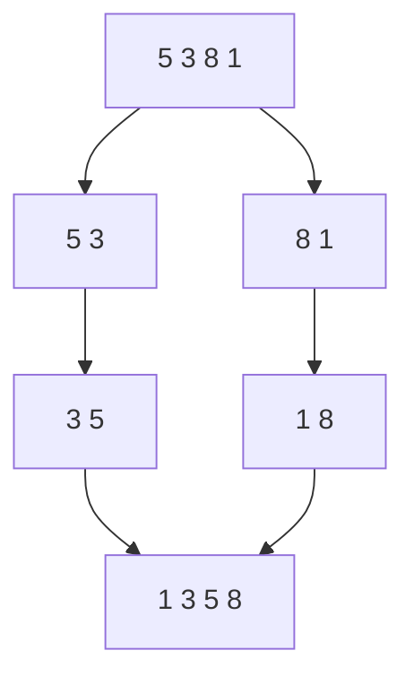

# マージソート: 小分けにしてから合体しよう

マージソートは、リストを半分ずつ分け、最後に小さい順になるよう合体する方法です。

バラバラにしたカードを、2つの山ごとに「小さいほうから先に出す」と考えると分かりやすいです。

## 使いどころ

- 大きなデータを安定して速く並べ替えたいとき
- 「分けて考える」再帰の練習をしたいとき
- クイックソートと違う考え方のソートを比べたいとき

## 手順

1. リストを半分に分ける
2. 左半分と右半分をそれぞれ並べ替える
3. 2つの並んだリストを、小さい順に合体する
4. 1つの並んだリストになったら完成

## 図で見る



## コピペ用コード

```python
def merge_sort(numbers):
    if len(numbers) <= 1:
        return numbers

    middle = len(numbers) // 2
    left = merge_sort(numbers[:middle])
    right = merge_sort(numbers[middle:])
    result = []

    while left and right:
        result.append(left.pop(0) if left[0] < right[0] else right.pop(0))

    return result + left + right

print(merge_sort([5, 3, 8, 1, 4]))
```

## コードの読み方

- `len(numbers) <= 1` は、もう分けなくてよい状態です。
- `left` と `right` は、それぞれ並び替え済みの小さなリストです。
- `while left and right` で、左と右の先頭を比べて小さいほうを取り出します。

## 計算量

マージソートは、分ける回数が少なく、合体では全体を1回ずつ見るため、だいたい `O(n log n)` で動きます。

## AOJで挑戦してみよう！

<div className="aojChallenge">
  <p className="aojChallenge__message">学んだレシピを実際に使って、ジャッジから「Accepted（正解）」を勝ち取ろう！</p>
  <div className="aojChallenge__links">
    <a className="aojChallenge__button" href="https://judge.u-aizu.ac.jp/onlinejudge/description.jsp?id=ALDS1_5_B&lang=ja" target="_blank" rel="noopener noreferrer">
      <span className="aojChallenge__label">ALDS1_5_B: Merge Sort</span>
      <span className="aojChallenge__icon" aria-hidden="true">↗</span>
    </a>
  </div>
</div>
