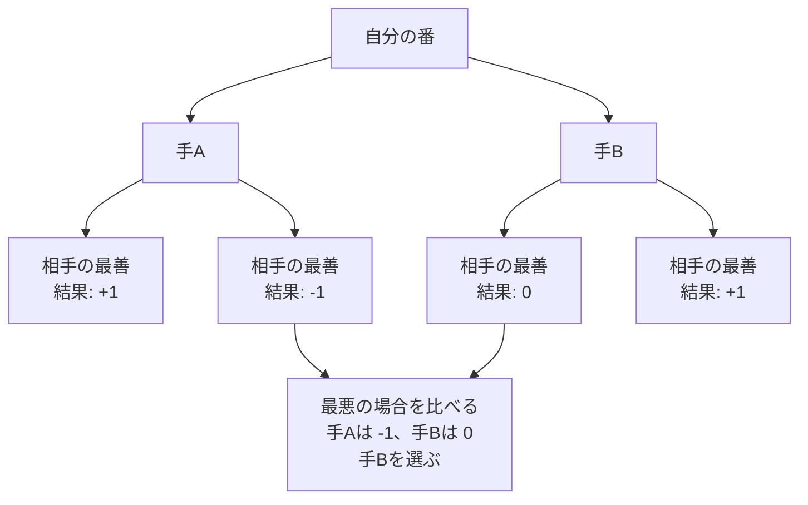

# Minimax法: 相手も最強だと考えて手を選ぼう

Minimax法は、自分は得をしたい、相手は自分を不利にしたい、と考えて数手先を読む方法です。

オセロや三目並べで「相手も一番いい手を打つはず」と考えて、自分の手を選ぶイメージです。

## ルール

1. 自分が選べる手を全部考える
2. その後、相手が一番よい手を選ぶと考える
3. 勝ちなら高い点、負けなら低い点をつける
4. 最悪の場合でも一番よい手を選ぶ

## 図で見る



## コピペ用コード

```python
def minimax(scores, is_my_turn):
    if isinstance(scores, int):
        return scores

    next_scores = []
    for score in scores:
        next_scores.append(minimax(score, not is_my_turn))

    if is_my_turn:
        return max(next_scores)

    return min(next_scores)

game_tree = [[1, -1], [0, 1]]
print(minimax(game_tree, True))
```

## コードの読み方

- `game_tree = [[1, -1], [0, 1]]` は、図の木をリストで表したものです。外側のリストが自分の手A・手B、内側が相手の応手の結果です。
- `isinstance(scores, int)` は「もう分かれ道がない（勝敗の点数になった）」という止まる条件です。
- 自分の番（`is_my_turn` が True）なら `max()` で一番得な手を、相手の番なら `min()` で自分が一番損する手を選びます。
- この例の答えは `0` です。手Aは相手に `-1` にされるので、最悪でも `0` の手Bを選びます。

## 別パターン1: 三目並べで実際に使う

実際のゲームでは、木をあらかじめ作らず、「盤面から打てる手を試して、戻す」をくり返します。三目並べ（○×ゲーム）の完全な例です。

```python
def winner(board):
    lines = [(0,1,2), (3,4,5), (6,7,8), (0,3,6),
             (1,4,7), (2,5,8), (0,4,8), (2,4,6)]
    for a, b, c in lines:
        if board[a] != " " and board[a] == board[b] == board[c]:
            return board[a]
    return None

def minimax(board, is_o_turn):
    win = winner(board)
    if win == "o":
        return 1
    if win == "x":
        return -1
    if " " not in board:
        return 0  # 引き分け

    mark = "o" if is_o_turn else "x"
    scores = []
    for i in range(9):
        if board[i] == " ":
            board[i] = mark          # 手を打つ
            scores.append(minimax(board, not is_o_turn))
            board[i] = " "           # 手を戻す
    return max(scores) if is_o_turn else min(scores)

def best_move(board):
    best_score = -2
    best_index = -1
    for i in range(9):
        if board[i] == " ":
            board[i] = "o"
            score = minimax(board, False)
            board[i] = " "
            if score > best_score:
                best_score = score
                best_index = i
    return best_index

board = ["o", "x", "o",
         "x", "x", " ",
         " ", " ", " "]
print(best_move(board))  # 5 (xのリーチを止める)
```

- `board[i] = mark` で手を打ち、探索が終わったら `board[i] = " "` で戻します。この「打って、調べて、戻す」が実戦形のMinimaxです。
- `winner()` が勝敗の判定、`minimax()` が読みの本体、`best_move()` が「一番点数の高い手」を選ぶ入口です。
- ○にとっての勝ちを `+1`、×の勝ちを `-1`、引き分けを `0` として、○は最大化、×は最小化します。

## 別パターン2: 深さ制限をつける

オセロや将棋のように全部読み切れないゲームでは、「◯手先まで読んだら、盤面のよさを点数で見積もる」形にします。

```python
def minimax_limited(board, depth, is_my_turn, evaluate, moves, apply, undo):
    if depth == 0 or not moves(board):
        return evaluate(board)

    scores = []
    for move in moves(board):
        apply(board, move)
        scores.append(
            minimax_limited(board, depth - 1, not is_my_turn,
                            evaluate, moves, apply, undo)
        )
        undo(board, move)

    return max(scores) if is_my_turn else min(scores)
```

- `depth == 0` になったら、勝敗が決まっていなくても `evaluate()`（評価関数）で盤面を採点して打ち切ります。
- 評価関数の出来が、そのままAIの強さになります。「石の数」「取れる場所の数」など、ゲームごとに設計します。

## 計算量

Minimax法は、打てる手が平均 b 通り、d 手先まで読むと **O(b^d)** かかります。

| ゲーム | 手の数の目安 | 全部読める？ |
| :--- | :--- | :--- |
| 三目並べ | 最大9手 | 読み切れる（約36万手） |
| オセロ | 約10通り×60手 | 読み切れない → 深さ制限＋評価関数 |
| 将棋・囲碁 | さらに膨大 | 枝刈りや[モンテカルロ法](/docs/algorithms/monte-carlo/)を併用 |

無駄な枝を調べない「アルファベータ枝刈り」という改良を入れると、同じ時間で約2倍深く読めるようになります。

## よくあるミス

| ミス | 何が起きるか | 対処 |
| :--- | :--- | :--- |
| 手を打ったあと戻し忘れる | 盤面が壊れて全部の読みがずれる | `apply` と `undo` を必ずペアにする |
| max と min を取り違える | 相手に有利な手を選ぶAIになる | 「自分の番＝max」を確認する |
| 引き分けの点数を決めていない | 勝ち筋がないとき暴走する | 勝ち・負け・引き分けの3つに点をつける |
