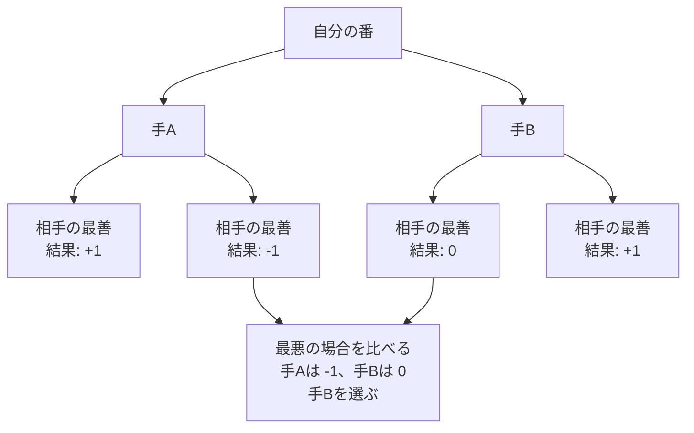

# Minimax法: 相手も最強だと考えて手を選ぼう

Minimax法は、自分は得をしたい、相手は自分を不利にしたい、と考えて数手先を読む方法です。

オセロや三目並べで「相手も一番いい手を打つはず」と考えて、自分の手を選ぶイメージです。

## ルール

1. 自分が選べる手を全部考える
2. その後、相手が一番よい手を選ぶと考える
3. 勝ちなら高い点、負けなら低い点をつける
4. 最悪の場合でも一番よい手を選ぶ

## 図で見る



## コピペ用コード

```python
def minimax(scores, is_my_turn):
    if isinstance(scores, int):
        return scores

    next_scores = []
    for score in scores:
        next_scores.append(minimax(score, not is_my_turn))

    if is_my_turn:
        return max(next_scores)

    return min(next_scores)


game_tree = [[1, -1], [0, 1]]
print(minimax(game_tree, True))
```

## 問いかけ

自分にとって一番よさそうな手でも、相手の返しで負けるなら、その手を選ぶべきでしょうか？
