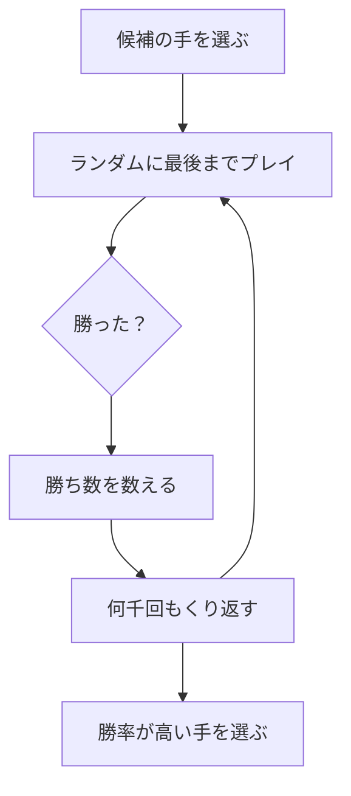

# モンテカルロ法: 何度も試して勝率を予想しよう

モンテカルロ法は、ランダムな実験をたくさん行って、答えを予想する方法です。

ゲームで「この手を選んだら勝ちやすいかな？」を、何万回も自動で試して勝率を見るイメージです。

## ルール

1. ランダムに試すルールを決める
2. 何度もシミュレーションする
3. 成功した回数を数える
4. 成功率から答えを予想する

## 図で見る



## コピペ用コード

```python
import random

def monte_carlo_dice(trials):
    wins = 0

    for _ in range(trials):
        player = random.randint(1, 6)
        enemy = random.randint(1, 6)

        if player > enemy:
            wins += 1

    return wins / trials

print(monte_carlo_dice(10000))
```

## コードの読み方

- `random.randint(1, 6)` は、1〜6 の整数をランダムに1つ返します。サイコロを1回振るのと同じです。
- `for _ in range(trials)` で、同じ実験を `trials` 回くり返します。使わない変数は `_` と書く習慣があります。
- `wins / trials` が勝率です。試行回数を増やすほど、理論値（この例では 15/36 ≒ 0.4167）に近づきます。

## 使いどころ

- 計算で厳密に解くのが難しい確率の見積もり
- ゲームAIで「どの手が勝ちやすいか」を試行して選ぶ
- 円周率のような値の近似
- 待ち行列や在庫のシミュレーション

## 別パターン1: 円周率を求める

モンテカルロ法の定番例です。正方形の中にランダムに点を打ち、円の中に入った割合から円周率を見積もります。

```python
import random

def estimate_pi(trials):
    inside = 0

    for _ in range(trials):
        x = random.random()  # 0.0〜1.0 の乱数
        y = random.random()

        if x * x + y * y <= 1:
            inside += 1

    return 4 * inside / trials

print(estimate_pi(100000))
```

- `random.random()` は 0.0 以上 1.0 未満の小数を返します。
- `x * x + y * y <= 1` は、点が半径1の円の内側にあるかの判定です。
- 「円の面積 ÷ 正方形の面積 = π/4」なので、割合を4倍すると円周率の近似になります。

## 別パターン2: じゃんけんの戦略を比べる

「あいこなら引き分け、勝ちなら1点」というルールで、2つの戦略を対戦させて勝率を比べます。

```python
import random

HANDS = ["グー", "チョキ", "パー"]
WIN_AGAINST = {"グー": "チョキ", "チョキ": "パー", "パー": "グー"}

def battle(trials):
    wins = 0

    for _ in range(trials):
        player = random.choice(HANDS)          # ランダム戦略
        enemy = random.choice(["グー", "グー", "パー"])  # グーを出しやすい相手

        if WIN_AGAINST[player] == enemy:
            wins += 1

    return wins / trials

print(battle(10000))
```

- `random.choice(リスト)` は、リストから1つをランダムに選びます。
- リストに同じ手を複数入れると、その手が出る確率を上げられます。「相手のくせ」を表現できます。
- 戦略部分を書き換えれば、いろいろな作戦の強さをシミュレーションで比べられます。

## 精度と試行回数

| 試行回数 | 結果のばらつき |
| :--- | :--- |
| 100回 | かなり大きい |
| 10,000回 | だいたい安定 |
| 1,000,000回 | ほぼ理論値に近い |

試行回数を10倍にすると、ばらつきはおよそ 1/√10 倍（約3分の1）になります。精度を1桁上げるには、試行回数を100倍にする必要がある、と覚えておくと見積もりに便利です。

## よくあるミス

| ミス | 何が起きるか | 対処 |
| :--- | :--- | :--- |
| 試行回数が少なすぎる | 実行のたびに結果が大きく変わる | まず1万回以上で試す |
| 乱数の範囲を間違える | `randint(0, 6)` だと0が出てしまう | `randint` は両端を含むことを確認する |
| 結果を1回だけ見て判断する | たまたまの偏りにだまされる | 何度か実行して安定しているか見る |
