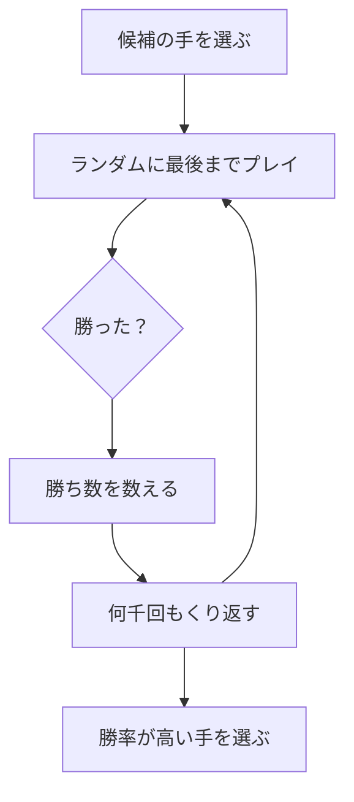

# モンテカルロ法: 何度も試して勝率を予想しよう

モンテカルロ法は、ランダムな実験をたくさん行って、答えを予想する方法です。

ゲームで「この手を選んだら勝ちやすいかな？」を、何万回も自動で試して勝率を見るイメージです。

## ルール

1. ランダムに試すルールを決める
2. 何度もシミュレーションする
3. 成功した回数を数える
4. 成功率から答えを予想する

## 図で見る



## コピペ用コード

```python
import random


def monte_carlo_dice(trials):
    wins = 0

    for _ in range(trials):
        player = random.randint(1, 6)
        enemy = random.randint(1, 6)

        if player > enemy:
            wins += 1

    return wins / trials


print(monte_carlo_dice(10000))
```

## 問いかけ

試す回数を100回から10000回に増やすと、予想はどう変わりそうですか？
