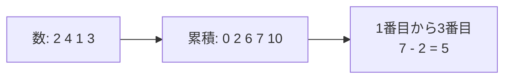

# 累積和: 区間の合計を一瞬で出そう

累積和は、左から順に合計をメモしておき、区間の合計を引き算で求める方法です。

毎回たくさん足し直す代わりに、「ここまでの合計」を先に作っておくのがポイントです。

## 使いどころ

- テストの点数の区間合計
- 日ごとの売上の合計
- 配列の一部分の合計を何度も聞かれる問題

## 手順

1. 最初に `0` を置く
2. 左から順に、ここまでの合計を追加する
3. 区間の合計は `右端までの合計 - 左端までの合計` で求める

## 図で見る



## コピペ用コード

```python
numbers = [2, 4, 1, 3]
prefix = [0]

for number in numbers:
    prefix.append(prefix[-1] + number)

left = 1
right = 3
print(prefix[right] - prefix[left])
```

## コードの読み方

- `prefix[0]` は、まだ何も足していないので `0` です。
- `prefix[-1] + number` で、前の合計に今の数を足しています。
- `prefix[right] - prefix[left]` で、いらない左側を引いています。

## 注意点

`left` と `right` の意味を決めておくことが大切です。この例では、`left` 以上 `right` 未満の区間を求めています。
