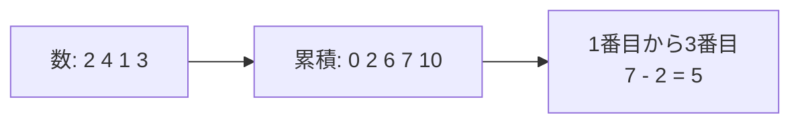

# 累積和: 区間の合計を一瞬で出そう

累積和は、左から順に合計をメモしておき、区間の合計を引き算で求める方法です。

毎回たくさん足し直す代わりに、「ここまでの合計」を先に作っておくのがポイントです。

## 使いどころ

- テストの点数の区間合計
- 日ごとの売上の合計
- 配列の一部分の合計を何度も聞かれる問題

## 手順

1. 最初に `0` を置く
2. 左から順に、ここまでの合計を追加する
3. 区間の合計は `右端までの合計 - 左端までの合計` で求める

## 図で見る



## コピペ用コード

```python
numbers = [2, 4, 1, 3]
prefix = [0]

for number in numbers:
    prefix.append(prefix[-1] + number)

left = 1
right = 3
print(prefix[right] - prefix[left])
```

## コードの読み方

- `prefix[0]` は、まだ何も足していないので `0` です。
- `prefix[-1] + number` で、前の合計に今の数を足しています。
- `prefix[right] - prefix[left]` で、いらない左側を引いています。

## 計算量

| 方法 | 前準備 | 1回の区間合計 | 合計をQ回聞かれたとき |
| :--- | :--- | :--- | :--- |
| 毎回足し直す | 不要 | O(n) | O(nQ) |
| 累積和 | O(n) | O(1) | O(n + Q) |

「区間の合計を何度も聞かれる」場面で威力を発揮します。1回しか聞かれないなら、普通に足しても変わりません。

## 別パターン1: itertools.accumulate を使う

Python 標準ライブラリで累積和を1行で作れます。

```python
from itertools import accumulate

numbers = [2, 4, 1, 3]
prefix = [0] + list(accumulate(numbers))

print(prefix)  # [0, 2, 6, 7, 10]
print(prefix[3] - prefix[1])  # 5 (2番目〜3番目の合計)
```

- `accumulate(numbers)` は `[2, 6, 7, 10]` のような「ここまでの合計」の列を作ります。
- 先頭に `[0]` を足しておくと、`prefix[right] - prefix[left]` の形がそのまま使えます。

## 別パターン2: テストの点数で「何日目から何日目までの合計」

日ごとの学習時間から、好きな期間の合計を何度でも一瞬で出す例です。

```python
study_minutes = [30, 45, 0, 60, 20, 90, 15]  # 月〜日

prefix = [0]
for minutes in study_minutes:
    prefix.append(prefix[-1] + minutes)

def total(start_day, end_day):
    """start_day 日目から end_day 日目まで（両端含む・1始まり）の合計"""
    return prefix[end_day] - prefix[start_day - 1]

print(total(1, 3))  # 月〜水: 75
print(total(4, 7))  # 木〜日: 185
```

- `total` 関数の中では、「1始まり・両端含む」を累積和の添字に変換しています。
- 区間の数え方（0始まりか1始まりか、端を含むか）を関数の中に閉じ込めると、間違えにくくなります。

## 2次元への発展

累積和は2次元（表の長方形領域の合計）にも拡張できます。区間加算をまとめて処理したい場合は、累積和を逆から使う[いもす法](/docs/algorithms/imos/)も参照してください。

## よくあるミス

| ミス | 何が起きるか | 対処 |
| :--- | :--- | :--- |
| 先頭の `0` を置き忘れる | 区間の左端で1つずれる | `prefix[0] = 0` から始める |
| 「以上・未満」の決めごとがぶれる | 合計が1個分ずれる | 区間の意味をコメントで書いておく |
| 元の配列を書き換えたのに累積和を作り直さない | 古い合計が返る | 値が変わるなら累積和を再計算する（頻繁なら[BIT](/docs/algorithms/binary-indexed-tree/)を検討） |

## 注意点

`left` と `right` の意味を決めておくことが大切です。この例では、`left` 以上 `right` 未満の区間を求めています。
