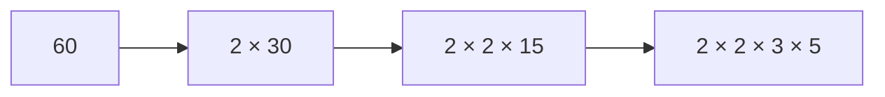

# 素因数分解: 数を素数のかけ算に分解しよう

素因数分解は、ある数を素数だけのかけ算に分ける方法です。

数を「これ以上分けられない材料」に分解するイメージです。例えば `60 = 2 × 2 × 3 × 5` のように表せます。

## 使いどころ

- 約数の個数を調べる
- 最大公約数や最小公倍数を考える
- 数の性質を調べる
- 暗号やセキュリティの入口を学ぶ

## 手順

1. 2から順番に割れるか試す
2. 割れる間は何度も割る
3. 割れなくなったら次の数を試す
4. 最後に残った数が1より大きければ、それも素因数

## 図で見る



## コピペ用コード

```python
def factorize(n):
    result = []
    divisor = 2
    while divisor * divisor <= n:
        while n % divisor == 0:
            result.append(divisor)
            n //= divisor
        divisor += 1
    if n > 1:
        result.append(n)
    return result

print(factorize(60))
```

## コードの読み方

- `while divisor * divisor <= n` は、調べる範囲を減らす工夫です。
- `while n % divisor == 0` で、同じ素数で割れるだけ割ります。
- 最後に `n > 1` なら、大きな素数が残っています。

## 計算量

試し割り法の計算量は **O(√n)** です。`divisor * divisor <= n` の工夫により、√n まで調べれば十分だからです（√n より大きい素因数は最大1個しか残らない）。

| n | ループ回数の目安 |
| :--- | :--- |
| 100万 | 約1,000回 |
| 1兆 | 約100万回 |
| 10^18 | 約10億回（きびしい） |

## 別パターン1: 素因数を「指数つき」でまとめる

`60 = 2² × 3 × 5` のように、素因数と個数のペアで持つ形です。約数の個数を数えるときに便利です。

```python
def factorize_dict(n):
    result = {}
    divisor = 2
    while divisor * divisor <= n:
        while n % divisor == 0:
            result[divisor] = result.get(divisor, 0) + 1
            n //= divisor
        divisor += 1
    if n > 1:
        result[n] = result.get(n, 0) + 1
    return result

factors = factorize_dict(60)
print(factors)  # {2: 2, 3: 1, 5: 1}

# 約数の個数 = (指数 + 1) をすべて掛ける
count = 1
for exponent in factors.values():
    count *= exponent + 1
print(count)  # 12 (60の約数は12個)
```

- 辞書の `result.get(divisor, 0) + 1` で、素因数ごとの登場回数を数えています。
- 約数の個数は「各素因数の (指数+1) の積」で求まります。`60 = 2² × 3¹ × 5¹` なら `3 × 2 × 2 = 12` 個です。

## 別パターン2: 2で割ってから奇数だけ試す

偶数の試し割りをスキップして、およそ2倍速くする定番の改良です。

```python
def factorize_fast(n):
    result = []

    while n % 2 == 0:
        result.append(2)
        n //= 2

    divisor = 3
    while divisor * divisor <= n:
        while n % divisor == 0:
            result.append(divisor)
            n //= divisor
        divisor += 2  # 奇数だけ試す

    if n > 1:
        result.append(n)
    return result

print(factorize_fast(360))  # [2, 2, 2, 3, 3, 5]
```

- 最初に2を割り切ってしまえば、残りの素因数は必ず奇数です。
- `divisor += 2` で偶数を飛ばします。結果は基本形と同じで、ループ回数が約半分になります。

## 別パターン3: たくさんの数を素因数分解する（最小素因数の表）

「1〜N のすべての数を素因数分解したい」ときは、[エラトステネスのふるい](/docs/algorithms/sieve-of-eratosthenes/)の要領で「最小の素因数」を前計算しておくと、1つあたり O(log n) で分解できます。

```python
def build_smallest_factor(limit):
    spf = list(range(limit + 1))  # spf[x] = x の最小素因数
    for i in range(2, int(limit ** 0.5) + 1):
        if spf[i] == i:  # i は素数
            for j in range(i * i, limit + 1, i):
                if spf[j] == j:
                    spf[j] = i
    return spf

def factorize_with_table(n, spf):
    result = []
    while n > 1:
        result.append(spf[n])
        n //= spf[n]
    return result

spf = build_smallest_factor(100)
print(factorize_with_table(60, spf))  # [2, 2, 3, 5]
print(factorize_with_table(84, spf))  # [2, 2, 3, 7]
```

- `spf[x]` に「x を割り切る最小の素数」を入れておき、それで割り続けるだけで分解できます。
- 表を作るのに O(N log log N) かかりますが、その後は何個でも高速に分解できます。クエリが多い問題向けです。

## 素因数分解と暗号の関係

大きな数の素因数分解は、コンピュータでも現実的な時間では終わりません。この「分解の難しさ」が、[公開鍵暗号](/docs/algorithms/public-key-cryptography/)の安全性を支えています。600桁の数の素因数分解が一瞬でできるようになったら、現在のインターネットの暗号は成り立たなくなります。

## よくあるミス

| ミス | 何が起きるか | 対処 |
| :--- | :--- | :--- |
| `while` を `if` にする | `4 = 2 × 2` の2個目を取り逃す | 同じ素数で割れるだけ割る |
| 最後の `if n > 1` を忘れる | `n = 6 → [2]` のように素因数が欠ける | √n より大きい素因数の取り残しに注意 |
| 範囲を `divisor <= n` にする | 動くが極端に遅い | `divisor * divisor <= n` で √n まで |

## 注意点

この方法は分かりやすい一方、とても大きな数では時間がかかります。まずは仕組みを理解するための基本形です。

## AOJで挑戦してみよう！

<div className="aojChallenge">
  <p className="aojChallenge__message">学んだレシピを実際に使って、ジャッジから「Accepted（正解）」を勝ち取ろう！</p>
  <div className="aojChallenge__links">
    <a className="aojChallenge__button" href="https://judge.u-aizu.ac.jp/onlinejudge/description.jsp?id=NTL_1_A&lang=ja" target="_blank" rel="noopener noreferrer">
      <span className="aojChallenge__label">NTL_1_A: Prime Factorization</span>
      <span className="aojChallenge__icon" aria-hidden="true">↗</span>
    </a>
  </div>
</div>
