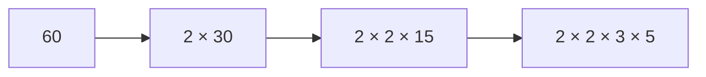

# 素因数分解: 数を素数のかけ算に分解しよう

素因数分解は、ある数を素数だけのかけ算に分ける方法です。

数を「これ以上分けられない材料」に分解するイメージです。例えば `60 = 2 × 2 × 3 × 5` のように表せます。

## 使いどころ

- 約数の個数を調べる
- 最大公約数や最小公倍数を考える
- 数の性質を調べる
- 暗号やセキュリティの入口を学ぶ

## 手順

1. 2から順番に割れるか試す
2. 割れる間は何度も割る
3. 割れなくなったら次の数を試す
4. 最後に残った数が1より大きければ、それも素因数

## 図で見る



## コピペ用コード

```python
def factorize(n):
    result = []
    divisor = 2
    while divisor * divisor <= n:
        while n % divisor == 0:
            result.append(divisor)
            n //= divisor
        divisor += 1
    if n > 1:
        result.append(n)
    return result

print(factorize(60))
```

## コードの読み方

- `while divisor * divisor <= n` は、調べる範囲を減らす工夫です。
- `while n % divisor == 0` で、同じ素数で割れるだけ割ります。
- 最後に `n > 1` なら、大きな素数が残っています。

## 注意点

この方法は分かりやすい一方、とても大きな数では時間がかかります。まずは仕組みを理解するための基本形です。

## AOJで挑戦してみよう！

<div className="aojChallenge">
  <p className="aojChallenge__message">学んだレシピを実際に使って、ジャッジから「Accepted（正解）」を勝ち取ろう！</p>
  <div className="aojChallenge__links">
    <a className="aojChallenge__button" href="https://judge.u-aizu.ac.jp/onlinejudge/description.jsp?id=NTL_1_A&lang=ja" target="_blank" rel="noopener noreferrer">
      <span className="aojChallenge__label">NTL_1_A: Prime Factorization</span>
      <span className="aojChallenge__icon" aria-hidden="true">↗</span>
    </a>
  </div>
</div>
