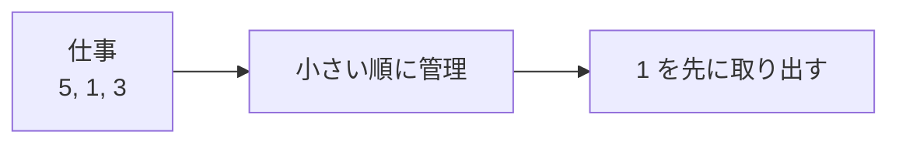

# 優先度付きキュー: 一番大事なものから取り出そう

優先度付きキューは、入った順番ではなく、優先度の高いものから取り出すデータ構造です。

普通のキューが「先着順」なら、優先度付きキューは「重要度順」です。

## 使いどころ

- ダイクストラ法
- 締切が近いタスクの管理
- ゲームAIで評価が高い候補から調べる処理
- 一番小さい値や大きい値を何度も取り出す処理

## 手順

1. 値を追加する
2. データ構造の中で順番が調整される
3. 取り出すと、優先度が一番高い値が出てくる

## 図で見る



## コピペ用コード

```python
import heapq

queue = []
heapq.heappush(queue, 5)
heapq.heappush(queue, 1)
heapq.heappush(queue, 3)

print(heapq.heappop(queue))
```

## コードの読み方

- Pythonの `heapq` は、小さい値ほど先に出る優先度付きキューです。
- `heappush()` で追加します。
- `heappop()` で一番小さい値を取り出します。

## 計算量

| 操作 | 優先度付きキュー（ヒープ） | ソート済みリスト | 普通のリスト |
| :--- | :--- | :--- | :--- |
| 追加 | O(log n) | O(n) | O(1) |
| 最小値の取り出し | O(log n) | O(1) | O(n)（毎回探す） |

「追加」と「最小値の取り出し」が混ざる場面で、両方をバランスよく速くできるのがヒープの強みです。内部の仕組みは[ヒープソート](/docs/algorithms/heap-sort/)で説明しています。

## 別パターン1: 大きい値から取り出す（最大ヒープ）

`heapq` は最小値優先なので、大きい順にしたいときは符号を反転して入れます。

```python
import heapq

queue = []
for score in [72, 91, 45, 88]:
    heapq.heappush(queue, -score)  # マイナスをつけて入れる

while queue:
    print(-heapq.heappop(queue))   # 取り出すとき戻す
# 91, 88, 72, 45 の順
```

- 入れるときに `-score`、取り出すときに `-` で戻す、の2箇所だけ変えます。
- 「一番小さい `-91`」が「一番大きい `91`」に対応する、という考え方です。

## 別パターン2: タプルで優先度とデータを一緒に持つ

実際のタスク管理では「優先度」と「中身」をセットで扱います。タプルの1番目で比較される性質を使います。

```python
import heapq

tasks = []
heapq.heappush(tasks, (2, "レポートを書く"))
heapq.heappush(tasks, (1, "提出期限を確認する"))
heapq.heappush(tasks, (3, "参考資料を読む"))

while tasks:
    priority, name = heapq.heappop(tasks)
    print(f"優先度{priority}: {name}")

# 優先度1: 提出期限を確認する
# 優先度2: レポートを書く
# 優先度3: 参考資料を読む
```

- タプルは1番目の要素（ここでは優先度の数字）から順に比較されます。数字が小さいほど先に出てきます。
- 優先度が同じもの同士だと2番目（文字列）で比較されます。比較できないオブジェクトを入れる場合は、`(優先度, 連番, データ)` のように間に連番を挟むのが定番です。

## 別パターン3: ダイクストラ法での使われ方

優先度付きキューの一番有名な活躍場所が[ダイクストラ法](/docs/algorithms/dijkstra/)です。「今わかっている中で一番近い場所」を毎回高速に取り出すために使います。

```python
import heapq

graph = {
    "A": [("B", 4), ("C", 2)],
    "B": [("D", 5)],
    "C": [("B", 1), ("D", 8)],
    "D": [],
}

def dijkstra(start):
    dist = {start: 0}
    queue = [(0, start)]  # (距離, 頂点)

    while queue:
        d, node = heapq.heappop(queue)
        if d > dist.get(node, float("inf")):
            continue  # 古い情報はスキップ

        for next_node, cost in graph[node]:
            new_dist = d + cost
            if new_dist < dist.get(next_node, float("inf")):
                dist[next_node] = new_dist
                heapq.heappush(queue, (new_dist, next_node))

    return dist

print(dijkstra("A"))  # {'A': 0, 'B': 3, 'C': 2, 'D': 8}
```

- `(距離, 頂点)` のタプルで入れることで、「距離が一番短い頂点」から取り出されます。
- 詳しい解説はダイクストラ法のページに譲りますが、「最小値を何度も取り出す処理はヒープに任せる」という型を覚えておくと応用が利きます。

## よくあるミス

| ミス | 何が起きるか | 対処 |
| :--- | :--- | :--- |
| リストに `append` してから `heappop` する | ヒープの形が壊れていて正しい順に出ない | 追加は必ず `heappush`（または最初に `heapify`） |
| `queue[0]` 以外を直接見る | ヒープの内部順はソート順ではない | 順に取り出したいなら `heappop` を使う |
| 比較できないオブジェクトをタプルに入れる | 優先度が同じとき `TypeError` | `(優先度, 連番, データ)` の形にする |

## 注意点

大きい値を優先したい場合は、値にマイナスをつけて入れる方法がよく使われます。

## AOJで挑戦してみよう！

<div className="aojChallenge">
  <p className="aojChallenge__message">学んだレシピを実際に使って、ジャッジから「Accepted（正解）」を勝ち取ろう！</p>
  <div className="aojChallenge__links">
    <a className="aojChallenge__button" href="https://judge.u-aizu.ac.jp/onlinejudge/description.jsp?id=ALDS1_9_C&lang=ja" target="_blank" rel="noopener noreferrer">
      <span className="aojChallenge__label">ALDS1_9_C: Priority Queue</span>
      <span className="aojChallenge__icon" aria-hidden="true">↗</span>
    </a>
  </div>
</div>
