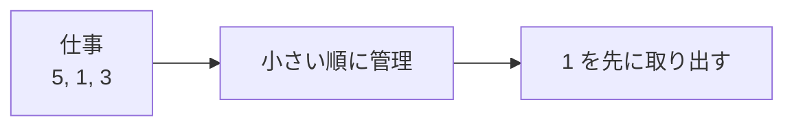

# 優先度付きキュー: 一番大事なものから取り出そう

優先度付きキューは、入った順番ではなく、優先度の高いものから取り出すデータ構造です。

普通のキューが「先着順」なら、優先度付きキューは「重要度順」です。

## 使いどころ

- ダイクストラ法
- 締切が近いタスクの管理
- ゲームAIで評価が高い候補から調べる処理
- 一番小さい値や大きい値を何度も取り出す処理

## 手順

1. 値を追加する
2. データ構造の中で順番が調整される
3. 取り出すと、優先度が一番高い値が出てくる

## 図で見る



## コピペ用コード

```python
import heapq

queue = []
heapq.heappush(queue, 5)
heapq.heappush(queue, 1)
heapq.heappush(queue, 3)

print(heapq.heappop(queue))
```

## コードの読み方

- Pythonの `heapq` は、小さい値ほど先に出る優先度付きキューです。
- `heappush()` で追加します。
- `heappop()` で一番小さい値を取り出します。

## 注意点

大きい値を優先したい場合は、値にマイナスをつけて入れる方法がよく使われます。

## AOJで挑戦してみよう！

<div className="aojChallenge">
  <p className="aojChallenge__message">学んだレシピを実際に使って、ジャッジから「Accepted（正解）」を勝ち取ろう！</p>
  <div className="aojChallenge__links">
    <a className="aojChallenge__button" href="https://judge.u-aizu.ac.jp/onlinejudge/description.jsp?id=ALDS1_9_C&lang=ja" target="_blank" rel="noopener noreferrer">
      <span className="aojChallenge__label">ALDS1_9_C: Priority Queue</span>
      <span className="aojChallenge__icon" aria-hidden="true">↗</span>
    </a>
  </div>
</div>
