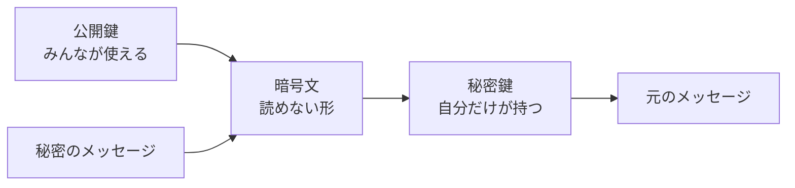

# 公開鍵暗号: 閉める鍵と開ける鍵を分けよう

公開鍵暗号は、暗号化に使う鍵と、復号に使う鍵を分ける考え方です。

「誰でも使える南京錠」は公開しておき、開けるための鍵だけを自分が持っているイメージです。

## ルール

1. 公開鍵はみんなに見せてよい
2. 秘密鍵は自分だけが持つ
3. 相手は公開鍵でメッセージを閉じる
4. 自分だけが秘密鍵で開けられる

## 図で見る



## コピペ用コード

これは学習用の小さな例です。実際のセキュリティには使わないでください。

```python
def encrypt(message, public_key, n):
    return pow(message, public_key, n)


def decrypt(cipher, private_key, n):
    return pow(cipher, private_key, n)


n = 33
public_key = 3
private_key = 7
message = 4

cipher = encrypt(message, public_key, n)
plain = decrypt(cipher, private_key, n)

print(cipher)
print(plain)
```

## 問いかけ

公開鍵をみんなに見せてもよいのに、なぜ秘密鍵は絶対に見せてはいけないのでしょう？
